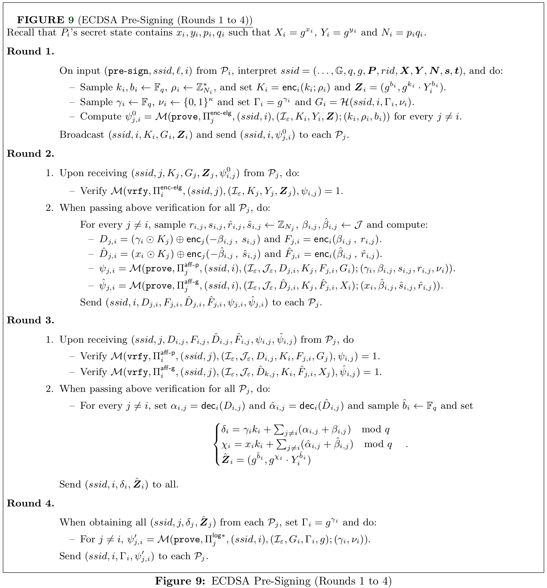
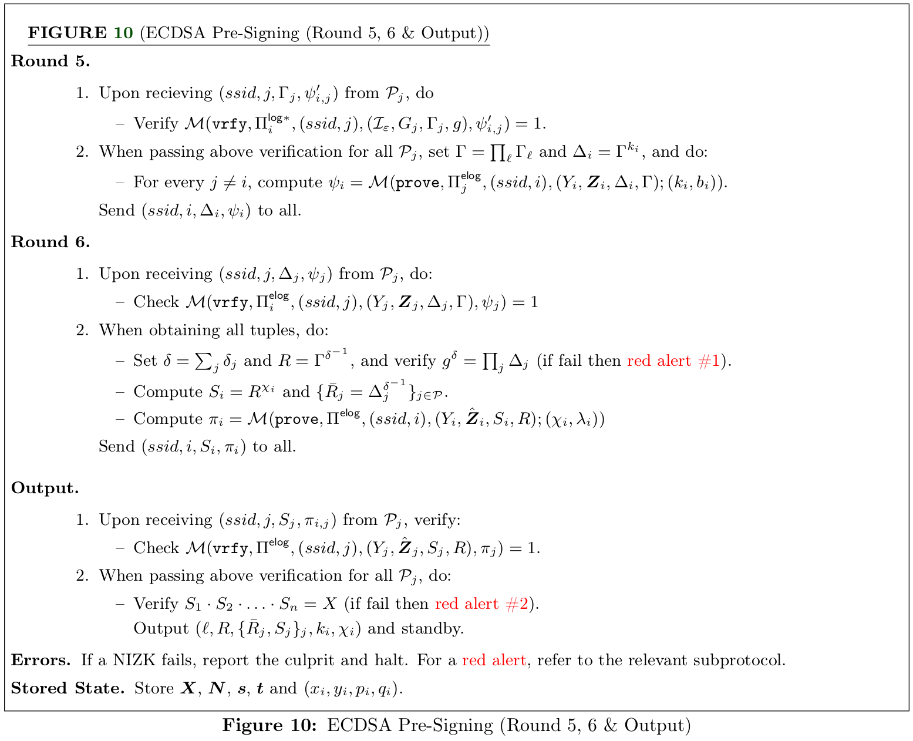
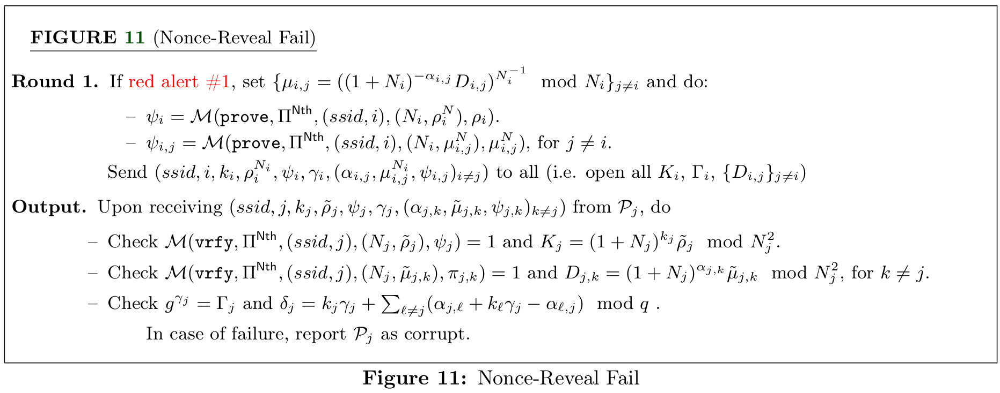
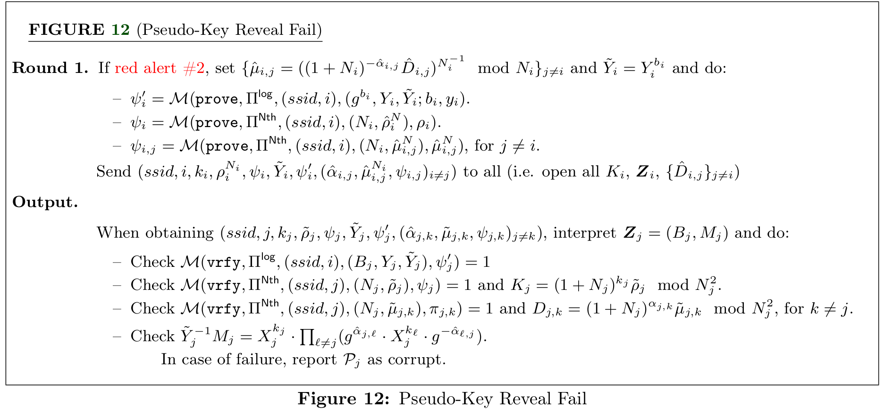

# $(t, n)$ case from Canneti et al. (2021)

In this work, Canneti et al. present a protocol for Threshold ECDSA signatures with the following characteristics:
- Only the last round of the protocol needs knowledge of the message to be signed. Therefore, all the previous rounds can be executed in a preprocessing stage.
- The protocol support adaptative corruption in the signing phase. In this case, the authors provide a mechanism to refresh the auxiliary information and keys used in the signing phase to provide security against an attacker that corrupts a different set of parties over the time.
- The protocol realizes an ideal threshold signing functionality in the UC framework.
- The protocol achieve identifiable abort in the signing process.

The above characteristics make this protocol compatible with solutions that use cold wallets in cryptocurrencies given that the protocols are non-interactive (i.e. only the last round requires the knowledge of the message to be signed). To allow a non-interactive signing phase, there is a process of pre-signing which can be computed without any knowledge of the message. The parties engage in a protocol $L$ times in a concurrent way to obtain pre-signing data for $L$ signatures. Once the message is known, the parties retrieve one tuple of the generated pre-signing data and use it to generate a signature. Then, the parties erase the pre-signing information once it is used.

The signing protocol can be divided into two phases: a preprocessing phase in which the keys and the required auxiliary information are established, and a non-interactive phase in which the parties locally retrieve the information needed to construct the signature and locally computes a share of it. 

It is important to mention that this work only focuses in the $n$-out-of-$n$ signature case and it does not cover the case of $t$-out-of-$n$ explicitly. However, to obtain a protocol for the later case, the protocol can be easily modified using Shamir secret-sharing as presented in [Gennaro & Goldfeder (2020)](https://eprint.iacr.org/2020/540).

## Preliminaries

As in previous works about threshold ECDSA, this work also uses Paillier encryption scheme extensively. Also, it uses heavily some zero-knowledge proofs to guarantee a correct execution in presence of malicious adversaries. The ZK-proofs used in this work will be presented in the next section along with an strategy to compile $\Sigma$-protocols into a non-interactive version using a random oracle via the Fiat-Shamir heuristic.

A concept that appears in this protocol different to its predecesor is the *proactive security*. Despite the fact that threshold signature protocols bring additional security for digital signatures, they may still be vulnerable against an attacker that can corrupt a set of parties that change over time. According to Canneti et al., in a proactive threshold signature scheme, the time is divided into epochs, such that at the end of each epochs, the parties engage in a protocol to refresh all the information needed to generate a signature (i.e. keys, local state and random values). If the protocol is proactive, it remains secure as long as at most $t - 1$ players are compromised within a single epoch. Therefore, if the set of compromised parties changes from one epoch to the next one, the protocol remains secure a long as the number of parties is in the threshold.

### NP-relations

In this section, we present the NP-relations that will be used in the protocol to determine whether the protocol has been executed correctly or not by using ZK-proofs.

### ZK-Module

Now, we present the strategy used by Canneti et al. to compile a $\Sigma$-protocol into a non-interactive version using the Fiat-Shamir heuristic. Aside of the standard prove and verify operations. This module contains a commit operation to output the first message $A$ of the ZK-proof, which is useful in the security analysis. The ZK-Module is presented next.

## Key generation

Briefly speaking about the key generation protocol, each party $P_i$ samples a random element $x_i \stackrel{R}{\leftarrow} \mathbb{F}\_q$ which will be an additive share of the secret key $x = \sum_{i=1}^n x_i$ and then reveals the value of $X_i = g^{x_i}$. Notice that $X = \prod_{i=1}^n X_i = g^x$ is the public key associated to $x$. By using ZK-proofs and commitments, the parties guarantee the consistency of $X_i$.

## Key refresh and auxiliary information

In the key refresh an auxiliary information phase, each party $P_i$ generates a fresh Paillier modulus $N_i$ and ring-Pedersen parameters $(s_i, t_i)$. Also, each party $P_i$ generates additive shares of zero $(x_i^1, \dots, x_i^n)$ such that $\sum_{j=1}^n x_i^j = 0$ and then computes the vector of group elements $\mathbf{X}_i = (X_i^1 = g^{x_i^1}, \cdots, X_i^n = g^{x_i^n})$. Then the party $P_i$ sends all the elements $N_i, s_i, t_i, \mathbf{X}_i$ to all the other parties. After obtaining all the values from other parties, each party encrypts $x_i^j$ under Paillier encryption scheme using the public key $N_j$ to obtain the value $C_i^j$ for $j \neq i$, and then, $P_i$ sends to $P_j$ the encrypted value.

Once each party receives the information sent above, they re-compute the shares of the secret key as $x_i^* = x_i + \sum_{j=1}^n x_j^i \mod q$, and update the group elements to be consistent with the new secret key shares by doing $X_i^* = X_i \cdot \prod_j X_j^i$. Also, each party stores the Paillier modulus and Pedersen parameters $(N_1, s_1, t_1), \dots, (N_n, s_n, t_n)$.

Throughout the execution of the protocol, the parties use ZK-proofs to guarantee the consistency of the values. For example, the parties use such proofs to check that the Paillier keys and Pedersen parameters are well-formed, and to check that the values of $X_i^j$ are consistent with the values of $x_i^j$.

Next, we present a detailed specification of the protocol taken from the paper of Canneti et al.

## Three-round presignin with $O(n^2)$ identification cost

Remember that one of the main contributions of the work of Canneti et al. is to propose a non-interactive protocol for signing. This means that all the rounds but the last one do not need the knowledge of the message to be executed. The rounds preceding the construction of the signature is called *pre-signing*. Here, we show a version of the presigning phase that has three rounds, and it can identify the corrupt parties with a cost of $O(n^2)$.

The pre-signing protocol of Canneti et al. uses similar techniques presented in [the signing protocol of Gennaro & Goldfeder (2020)](../gennaro_goldfeder_2020/#signing-protocol). Specifically, in both works they use the concept of transforming multiplicative shares into additive shares using the Paillier encryption scheme. This technique allows to compute additive shares of a masked version of $k$ and also it allows them to find additive shares of $k \cdot x$, where $k$ is the nonce used in the signing process. At the end of the signing protocol, the parties will obtain shares $(R, k_i, \chi_i)$, where $k_i$ is an additive share of the nonce $k$, $\chi_i$ is a share of $k \cdot x$ and $R = g^{k^{-1}}$.

One of the advantages of this protocol is that the parties can engage in $L$ concurrent sessions to generate tuples $\left \\{ (l, R_l, k_{i, l}, \chi_{i, l}) \right \\}_{i=1}^L$ as the pre-signing material for $L$ signatures. The parties can store this tuples in the local memory and they extract a fresh tuple once the message to be signed is known. However, it is important to ensure that the parties erase the pre-signing tuples that were already used to avoid security vulnerabilities.

We present a detailed specification of the protocol next, which is taken from the paper of Canneti et al.

### Signing

Once the pre-signing phase has been executed, parties have shares $(R, k_i, \chi_i)$ in their local memory. Therefore, once the parties know the hash of the message $m$ to be signed, they can retrieve a pre-signing tuple $(R, k_i, \chi_i)$, then compute $r = R \vert_{x-\text{axis}}$, and locally compute an additive share of the signature $\sigma_i = k_i \cdot m + r \cdot \chi_i \mod q$. Then, each party broadcast the additive share $\sigma_i$ to the rest of the parties to reconstruct the signature $(r, \sigma)$. It is important to remember that the parties must erase the used pre-signing tuples.

## Six-round presigning with $O(n)$ identification cost

In their paper, Canneti et al. present an alternative to compute the presignin phase that takes six rounds but it has a linear identification cost, contrary to the previous version where the presigning takes three rounds but a quadratic identification cost. The differences of this version with respect to the previous one can be highlighted in two points: (1) the parties publish the values of $\Gamma_i = g^{\gamma_i}$ after the computation of $\delta = k \cdot \gamma$, and (2) the parties commit the share $\chi_i$ using an Elgamal fashion to generate a pseudo-key $S_i = R^{\chi_i}$ to identify the corrupt parties in an abort. Next, we present the protocol specification taken from the paper of Canneti et al.

### Identification process

In this version of the protocol, the abort can be produced in two points: (1) when $g^\delta \neq \prod_i \delta_i$ in Round 6, and (2) when $\prod S_i \neq X$ in Round 7. The difficulty here is that if one of those checks does not pass, it is not immediate which of the parties produced the fault. To solve this, depending on the fault point, the parties are instructed to reveal in zero-knowledge the plaintext values of $K_i$ and $\\{ D_{i,j} \\}$ and the power of $\Gamma_i$ for the fault point (1), and the plaintext values of $K_i$ and $\\{ \hat{D}\_{i,j} \\}$ and the secret hidden by $\mathbf{Z}\_i$ for the fault point (2). With these values, the parties now can identify who is the party who produced the fault. For more details, we present the specification of the identification process for both points in the following protocols taken from the paper of Canneti et al.

### Signing

Once the hash $m$ of the message is known, the parties retrieve a tuple $(l, R, \\{ \bar{R}\_j, S_j \\}\_j, k_i, \chi_i)$ coming from the presignin phase and stored in the local memory. Then, the parties compute a share of the signature by calculating $r = R \vert_{x-\text{axis}}$ and then they set $\sigma_i = k_i \cdot m + r \cdot \chi_i \mod q$. Each party broadcast its share $\sigma_i$, and when the party has the shares of the other parties, the party checks that $R^{\sigma_j} = \bar{R}\_j^m \cdot S_j^r$ for all $j \neq i$. If all checks pass, then the party returns $\left (r, \sum \sigma_i \right )$ as the signature. Next, we present all the details of the signing protocol taken from the paper of Canneti et al.

## $\Sigma$-protocols

In this section, we present some of the underlying $\Sigma$-protocols used to provide security agains malicious adversaries. Similar to the paper of Canneti et al., we exclude the protocols for those NP-relations that are similar to the ones presented here or they are Schnorr based proofs. For more details about the remaining protocols, we refer the reader to Appendix C. in the paper of Canneti et al. Remember that all the relations used in this review are presented in the [list of relations](#np-relations) presented in a previous section.  

### Paillier encryption in range

This protocol is the $\Sigma$-protocol for the relatin $R_{\textsf{enc}}$. In this case, the input of the protocol for tuples of the form $(\mathcal{I}, C; k, r_0)$, where $\mathcal{I} = \\{-2^l, \dots, 0, \dots, 2^l\\}$ (remember that this set is denoted as $\pm 2^l$). The Prover want to convince the Verifier that he knows $k \in \pm 2^l$ , such that $C = (1 + N_0)^k \cdot r_0^{N_0} \mod N_0^2$. Next, we will present the details of the protocol taken from the paper of Canneti et al.

### Paillier operation with group commitment in range

### Paillier-Blum modulus in zero-knowledge

### Ring-Pedersen parameters in zero-knowledge

## Security concerns

### For the three round version 

### For the six round version 

# References

- Canetti, R., Gennaro, R., Goldfeder, S., Makriyannis, N., & Peled, U. (2020). UC Non-Interactive, Proactive, Threshold ECDSA with Identifiable Aborts. Proceedings of the 2020 ACM SIGSAC Conference on Computer and Communications Security, 1769–1787. https://doi.org/10.1145/3372297.3423367
- Rosario Gennaro, & Steven Goldfeder. (2020). One Round Threshold ECDSA with Identifiable Abort.