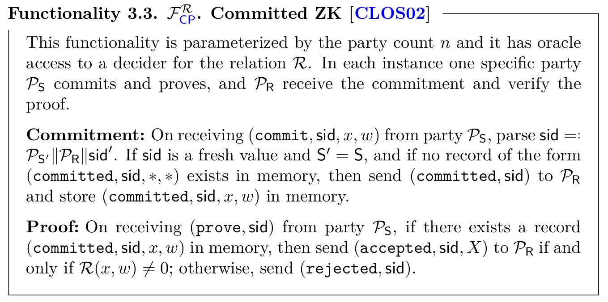
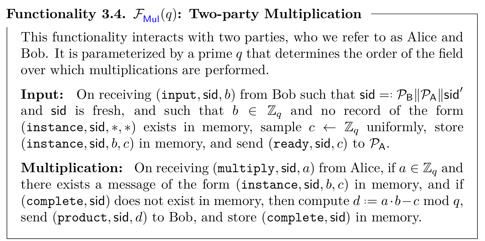
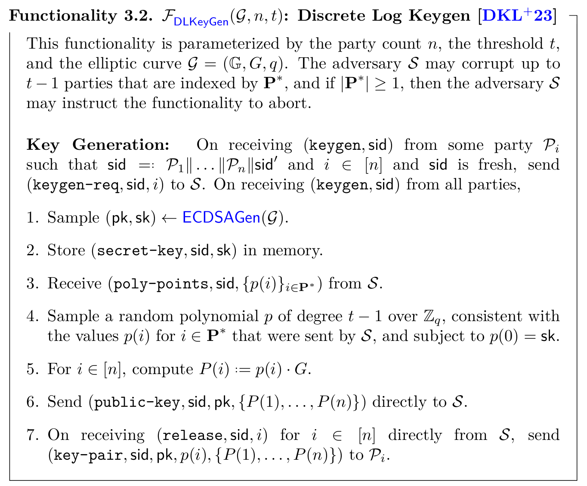
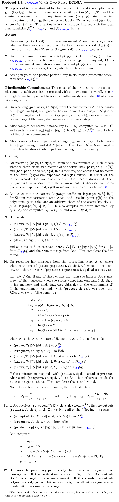
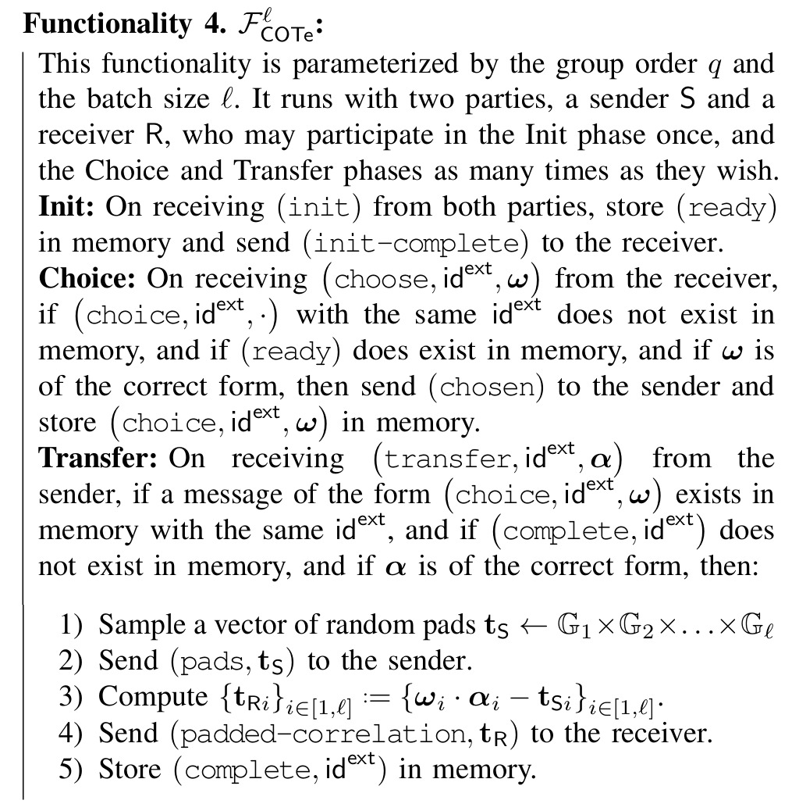
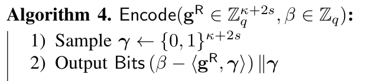
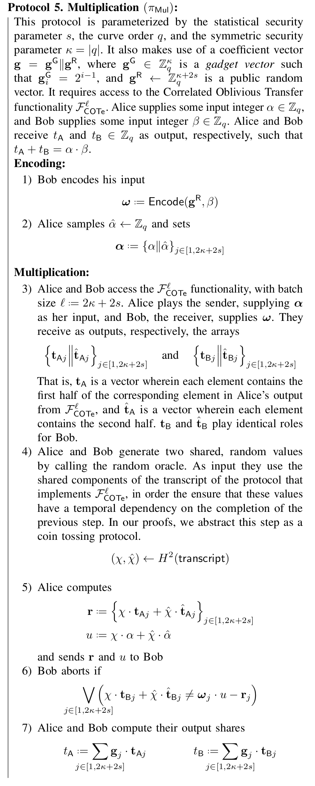

# (2, n) case from Doerner et al. (2018) 

The protocol proposed by Doerner et al. (2018) exposes the a threshold ECDSA protocol with threshold $2$-out-of-$n$. This means that from a set of $n$ parties, whatever two parties from this set can generate a signature. This protocol has two different versions. The most recent version aims to correct some issues found in the first version which improves the quality of the cryptographic assumptions and correct some errors. Those issues will be covered here as concerns given that it may happen that some organizations have an implementation of the older version which needs corrections in an audit process.

First, we start to show the newest version of the protocol. The parties interact with other three ideal functionalities:

- $\mathcal{F}\_{\textsf{CP}}^{\mathcal{R}\_\textsf{DL}}$: this functionality is the standard commited zero-knowledge functionality which allows to commit to the exponent of a elliptic curve point, and also performs a zero-knowledge proof on the relation $\mathcal{R}\_\textsf{DL} = \left\\{(A, B, w ) \\;\vert\\; B = w \cdot A \right\\}.$
- $\mathcal{F}_{\textsf{Mul}}(q)$: in this functionality, two parties provide elements $a, b \in \mathbb{Z}\_q$ respectively. and the functionality computes $d = a \cdot b - c$ where $c$ is a random element chosen from $\mathbb{Z}_q$. At the end of the protocol one party learns $d$ and the other party learns $c$. Intuitively, $\mathcal{F}\_{\textsf{Mul}}(q)$ returns to each party an additive share of the product of the inputs they provided to the functionality, i.e., $d$ and $c$ are randomly distributed numbers such that $d + c = a \cdot b$.
- $\mathcal{F}_{\textsf{DLKeyGen}}(\mathcal{G}, n, 2)$: this is a functionality that generates a key pair $(\textsf{sk}, \textsf{pk})$ for the ECDSA signature scheme and distributes Shamir shares of $\textsf{sk}$ with threshold $t$.

We next present the functionalities mentioned above:

Now, we present the protocol that realizes the functionality $\mathcal{F}_\textsf{ECDSA-2P}(\mathcal{G}, n)$ presented in the original paper, which is the main functionality. In this specification, $\textsf{RO}$ is a non-programmable global random oracle.

We stress that this protocol has multiple versions and people were able to implement an older version of it containing errors or assumptions that are not well studied. We encourage to the reader to refer to the section about concerns below to be informed about possible modifications.

All we have left is a protocol that the realizes the $\mathcal{F}_\textsf{Mult}$ functionality. Remember that this functionality takes two elements $\alpha, \beta \in \mathbb{Z}_q$ and returns additive shares of their product $\alpha \cdot \beta$. This functionality allows one of the aprties to introduce a noise to the multiplication which models the capabilities of a malicious adversary. According to the paper, such adversarial behavior is then detected in the signature verification in the broader context of the signature protocol.

Now, we will present the multiplication protocol. This protocol corresponds to the older version of the paper, therefore they use the [KOS OT method](https://eprint.iacr.org/2015/546.pdf) to realize the correlated oblivious transfer extension $\mathcal{F}_\textsf{COTe}^\mathcal{l}$. Remember that the use of the original protocol must be deprecated and replaced by a secure realization of the functionality. The specification of this functionality is shown next:

The multiplication protocol is similar to the classic Gilboa OT-multiplication, however, this method is vulnerable to selective failure attacks in the malicious setting. To correct this, Doerner et al. (2018) encode Bob's input with some redundancy in a way such that learning $s$ of the Bob's choice bits via selective failure does not leak any information about the input value. The encoding works as follows:

Here, $\mathbf{g}^\textsf{R} \in \mathbb{Z}_q^{\kappa + 2s}$ is a random vector. Now we present the multiplication protocol: 

## Security concerns

As we have mentioned above, this protocol has multiple versions. So it is of high importance to check which implementation is going to be audit always suggesting to include the more recent one due to the improvements made. Here, we will present some of such concerns:

- The original paper of this implementation has some errors that were corrected in the current version of the protocol. This older version have been implemented and deployed by some organizations. Therefore, from an audit point of view it is important to check which version is being implemented.
- The original scheme in this work realizes a non-standard two-party functionality that allows one pearty to negibly bias the distribution of the instance key. This fact is not a serious concern as the bias is negligible and they gave a proof of security, it gives more confidence to realize a standar functionality.
- Deprecate the use of [Keller et al. (2015)](https://eprint.iacr.org/2015/546) for OT extension protocols  given that [Roy (2022)](https://eprint.iacr.org/2022/192) have found some gaps in the proof.
- The older version of the paper has some typos in the reproduction of the OT protcol taken from Keller et al. (2020).
- The original version of the paper left implicit some details about how to deal with aborts when a functionality has multiple sub-sessions being executed concurrently. In the case of correlated oblivious transfer extensions (COTe) and multiplication functionalities, one must check that if a sub-session aborts, then the other concurrent sub-subsessions being executed must abort too. This also must be transferred to the ECDSA signing protocol in which multiple multiplication functionalities are executed concurrently: an abort in any instance of the multiplication protocol executed by some pair of parties must cause an abort in all the signing sub-sessions in wich the parties are involved and prevent them from signing toghether again.
- The original proof contains an optimized "coalesced triple-multiplication in which no proof of security is presented. The authors strongly recomend not to use such implementation in the future until a proof of security is provided.
- The newest version of the protocol assumes that all of the parties in any protocol are fully conected using authenticated channels.
- The newest version of the protocol does not include an specification of what to do in the first step of the setup when there exists a record $(\textsf{key-pair}, \textsf{sid}, \textsf{pk}, p(i))$.
- In Step 2 of the setup protocol, if the key generation protocol aborts, the parties send an abort signal to the environment.
- We need to check if there is an initialization process in the protocol used to realize the functionality $\mathcal{F}_\textsf{Mul}(q)$. If the initialization is required, Step 3 in the Setup phase is a good place to compute it.
- In the Signing phase, Step 7, we need to check if that the conditions imposed on the records does not hold, the signin message from the environment must be ignored.
- In the Signing phase, Step 8, the authors do not introduce what is $\textsf{RO}$. But in the proof you can find that $\textsf{RO}$ is a non-programable global random oracle. We need to check that in the real implementation, there is a proper instantiation of it.
- The newest version of the paper contains additional steps in the $\pi_\textsf{ECDSA-2P}$ protocol, namely, Steps 4-6 which is a commitment to the Alice's share of a random element in the elliptic curve. We should check that the commitment is performed.
- Bob need to check if the resulting signature $\sigma$ is a valid signature with respect to the message $m$ before outputing it.
- In the protocol for multiplication $\pi_\textsf{Mul}$, Bob must need to perform the checking in Step 6.
- The paper sugests to use SHA-256 to instantiate the random oracle $H$. Also, they use this hash function to instantiate the PRG.
- **[List all the ZK proofs needed the algorithm]**

# References

- Doerner, J., Kondi, Y., Lee, E., & Shelat, A. (2018). Secure Two-party Threshold ECDSA from ECDSA Assumptions. In 2018 IEEE Symposium on Security and Privacy (SP) (pp. 980-997).
- Keller, P. (2015). Actively Secure OT Extension with Optimal Overhead. In Advances in Cryptology – CRYPTO 2015 (pp. 724–741). Springer Berlin Heidelberg.
- Lawrence Roy (2022). SoftSpokenOT: Quieter OT Extension from Small-Field Silent VOLE in the Minicrypt Model. In Advances in Cryptology - CRYPTO 2022 - 42nd Annual International Cryptology Conference, CRYPTO 2022, Santa Barbara, CA, USA, August 15-18, 2022, Proceedings, Part I (pp. 657–687). Springer.

