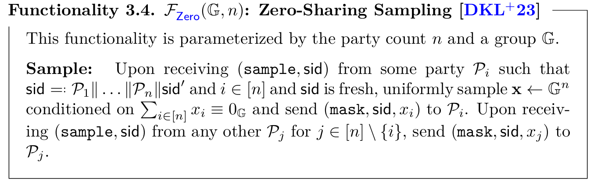
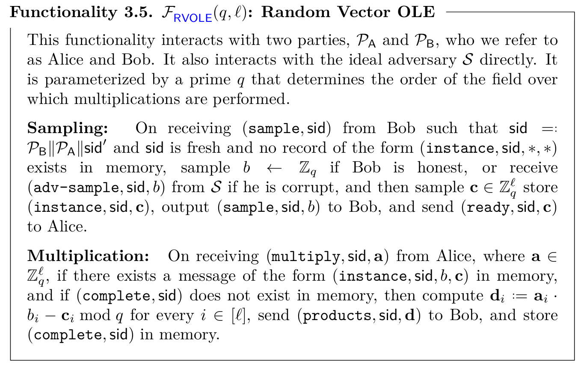
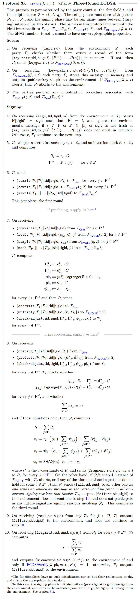

# $(t, n)$ case from Doerner et al. (2023)

## Preliminaries

In this work, Doerner et al. present a $t$-out-of-$n$ threshold ECDSA signature protocol that fully subsumes the works of Doerner et al. (2018) and Doerner et al. (2019). This work realizes a standard ECDSA signature functionality in three rounds with statistical security instead of computational security as in the works of Doerner et al. (2018) and Doerner et al. (2019). There in this section, we will use the notation used by Doerner et al. (2018).

This work is based on *ECDSA tuples* which are tuples of the form $(\phi, r, u, v)$, such that $r$ is the secret pre-signature instance key, $u = r \cdot \phi$ and $v = \phi \cdot \textsf{sk}$. Notice that an ECDSA signature is of the form

$$
s = \frac{a + \textsf{sk} \cdot b}{r},
$$

where $a$ and $b$ are publicly known values. Therefore, if we have secret shares of an ECDSA tuple $(\phi, r, u, v)$, we can make public $w = a \cdot \phi + b \cdot v$ and $u$ to obtain $s = w / u$. Notice that if the secret sharing is linear, then $w$ can be computed locally and the signature assembling will take just one round coming from reconstructing $w$ and $u$.

The work of Doerner et al. (2023) focuses on constructing the ECDSA tuples and checking that such tuple is consistent with the public key $\textsf{pk}$ and the value $R = r \cdot G$ generated in the signing process. This is done by using pairwise statistical consistency checks from Doerner et al. (2019). Also, the generation of ECDSA tuples is done by using pairwise oblivious linear evaluation (VOLE).

The protocol uses the functionality $\mathcal{F}\_\textsf{DLKeyGen}(\mathcal{G}, n, t)$ to generate Shamir shares of keys for discrete logarithm cryptosystems. This functionality was presented in the previous section of this document, and we refer to the reader there. The protocol also relies on a standard commitment functionality $\mathcal{F}_\textsf{Com}$. 

The protocol uses a functionality to sample uniform secret-shares of zero in a non-interactive way, which can be realized in the $\mathcal{F}_\textsf{Com}$-hybrid random oracle model. Next, we present the functionality for distributing shares of zero.

Finally, to realize the ECDSA functionality, the authors make use of a random vector oblivious linear functionality denoted by $\mathcal{F}_\textsf{RVOLE}(q, \mathcal{l})$. In this functionality, the first party (Bob) to invoke the functionality receives a single random value. Then, the other party (Alice) inputs a vector of chosen values. The output of the functionality will be additive shares of the product of the random value sent to Bob with each element of the vector provided by Alice. **Here, we will present the functionality taken from Doerner et al. (2023). However, there is a typo in such specification. In The Multiplication step, the functionality computes $\mathbf{d}_i = \mathbf{a}_i \cdot b - \mathbf{c}_i$. The value of $b$ does not have any sub-index.**

## The basic three-round protocol

First, let us show an intuition of the protocol. Suppose that each party $\mathcal{P}_i$ has knowledge of additive shares $r_i$ and $\textsf{sk}_i$ for $r$ and $\textsf{sk}$. Also, suppose that $\mathcal{P}_i$ samples a random uniform mask $\phi_i$. Suppose also they know $u_i$ and $v_i$ such that

$$
\sum_{i \in \mathbf{P}} u_i = \sum_{i \in \mathbf{P}} r_i \cdot \sum_{i \in \mathbf{P}} \phi_i,
$$

and

$$
\sum_{i \in \mathbf{P}} v_i = \sum_{i \in \mathbf{P}} \textsf{sk}\_i \cdot \sum_{i \in \mathbf{P}} \phi_i.
$$

Having these ingredients, we can compute a valid signature for $m$ under $\textsf{pk} = \textsf{sk} \cdot G$ and $R = r \cdot G$ by doing

$$
\frac{\sum_{i \in \mathbf{P}} \left( \textsf{SHA}(m) \cdot \phi_i + r^\textsf{x} \cdot v_i \right)}{\sum_{i \in \mathbf{P}} u_i} = \frac{\textsf{SHA}(m) + r^\textsf{x} \cdot \textsf{sk}}{r}.
$$

The only thing that we have left is to check that $\textsf{pk} = \textsf{sk} \cdot G$ and $R = r \cdot G$ were consistently generated and that any party added any offset in the middle of the process. The latter concern can be addressed by testing that the final signature is a valid signature for the message $m$ by verifying the signature as in the standalone ECDSA. For the latter, the authors propose an additional check as follows. Suppose that $\mathcal{P}\_i$ has $\mathbf{c}\_{i, j}^\textsf{u}$ and $\mathbf{c}\_{i, j}^\textsf{v}$, and each party $\mathcal{P}\_j$ has $\mathbf{d}\_{j, i}^\textsf{u}$ and $\mathbf{d}\_{j, i}^\textsf{v}$ such that $\mathbf{c}\_{i, j}^\textsf{u} = r_i \cdot \phi_j - \mathbf{d}\_{j, i}^\textsf{u}$ and $\mathbf{c}\_{i, j}^\textsf{v} = \textsf{sk}\_i \cdot \phi_j - \mathbf{d}\_{j, i}^\textsf{v}$. Having this correlations, $\mathcal{P}\_i$ sends $R_i = r_i \cdot G$ and $\textsf{pk}\_i = \textsf{sk}\_i \cdot G$, and then send values $\mathbf{\Gamma}\_{i, j}^\textsf{u} = \mathbf{c}\_{i, j}^\textsf{u} \cdot G$ and $\mathbf{\Gamma}\_{i, j}^\textsf{v} = \mathbf{c}\_{i, j}^\textsf{v} \cdot G$ to authenticate the values of $R_i$ and $\textsf{pk}\_i$ by verifying the equality $\mathbf{\Gamma}\_{i, j}^\textsf{u} = R_i \cdot \phi_j - \mathbf{d}\_{i, j}^\textsf{u} \cdot G$. Notice that the probability that this equality holds when $\mathcal{P}\_i$ sending $R_i \neq r_i \cdot G$ is negligible in $\kappa$. A similar check can be performed by $\mathcal{P}_j$.

Next, we present the three-round protocol.

According to the authors, this protocol can be improved using *pipelining* and *preprocessing*. On the one hand, pipelining refers to the fact that the first round of the protocol can be computed before the message $m$ is known. This allows a set of parties to sign a bunch of messages together to evaluate the first round of one signing instance simultaneously with the last round of the previous signing instance. Such improvement reduces the number of rounds to two in the overall process. On the other hand, preprocessing allows the first two rounds of the protocol to be evaluated before the message is known, leaving the last round as the only one to be evaluated online. However, using preprocessing has some conditions to be fulfilled that lead to new potential attack vectors. The authors recommend using the preprocessing only when the technique is fully understood and accepting the implications and risks that it has.

As mentioned before, this work subsumes the work of Doerner et al. (2018) which is a $2$-out-of-$n$ threshold signature scheme. The protocol presented in this work can be modified to reach the same communication properties as its predecessor. Those modifications are equivalent to a rushing behavior and in this case, the protocol is secure because it was proven secure against rushing adversaries.

It is also important to highlight that when the corrupted parties are strictly less than $t/2$, the protocol can be modified to take advantage of techniques like replicated secret-sharing schemes which improve the bandwidth and round complexity.

## Security concerns 

- The authors suggest realizing the multiplication functionality using a refinement of the protocol of Doerner et al. (2019).
- The protocol assumes that the parties are fully connected using authenticated channels. So we need to check how this condition is fulfilled.
- The functionality for ECDSA threshold signing makes a formal difference between all the possible aborts. We need to check that the aborts fulfill all the conditions stated in the protocol specification.
- The protocol to realize the RVOLE functionality has an initialization phase that is not present in the paper. Therefore, it is imperative to check that this initialization phase is done securely.
- The authors mention that the protocol of Haitner et al. 2023 can be used to realize a weaker version of the RVOLE functionality. However, the authors have not proven the use of such functionality to be secure in combination with the protocol they propose.
- In Step 8 the parties need to check the equalities to check that the shares of $R$ and $\textsf{pk}$ were used honestly.
- If the checks of Step 8 do not hold or the RVOLE functionality aborts between $\mathcal{P}_i$ and $\mathcal{P}_j$, $P_i$ must send a failure message to all other parties and also sends an analogous message at the corresponding point in all concurrent signing sessions that involve $\mathcal{P}_j$. Also, the party sends a failure message to the environment, does not continue with Step 10, and does not participate in any future signing session with $\mathcal{P}_j$. It is needed to check how the last fact is ensured in a real-world implementation.
- In the last step of the signing phase, the party verifies that the produced signature is a valid signature using the standalone version of the ECDSA signature scheme.
- If the protocol uses preprocessing, it is necessary that all the conditions in which preprocessing can be applied are met. Also, we must be sure that the client of an audit agrees with the implications and risks associated with preprocessing.

### Commitments

In the protocol $\pi_\textsf{ECDSA}$, Step 6, each party $P_i$ commits to the value of $R_i$.

# References

- Jack Doerner, Yashvanth Kondi, Eysa Lee, & abhi shelat. (2019). Threshold ECDSA from ECDSA Assumptions: The Multiparty Case.

 
