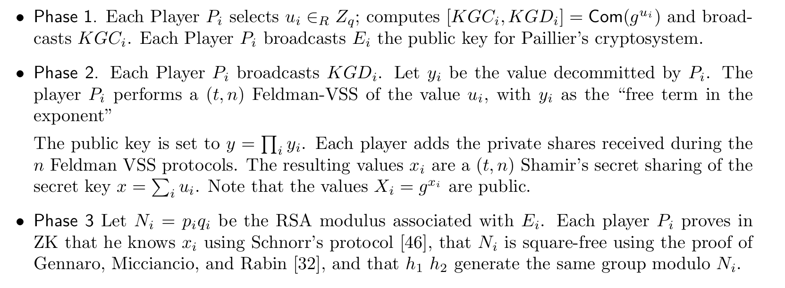
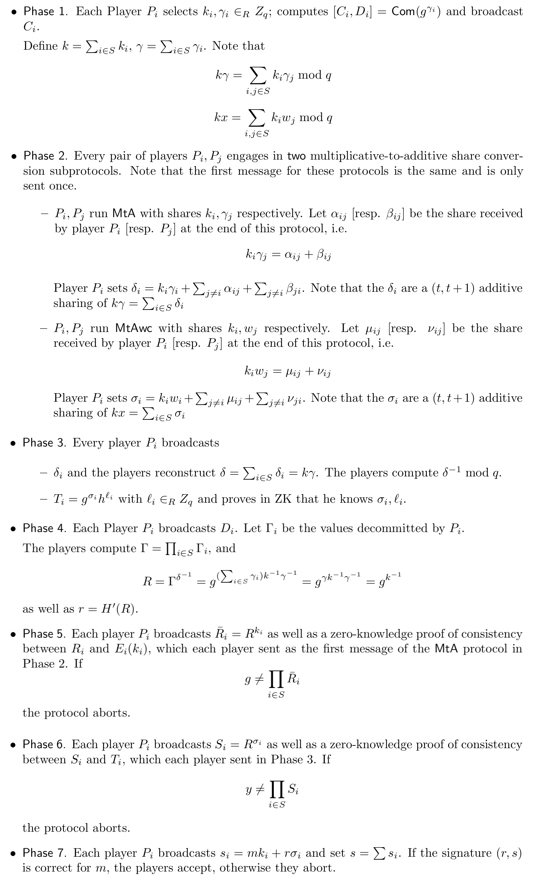
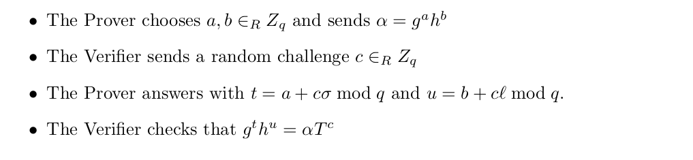
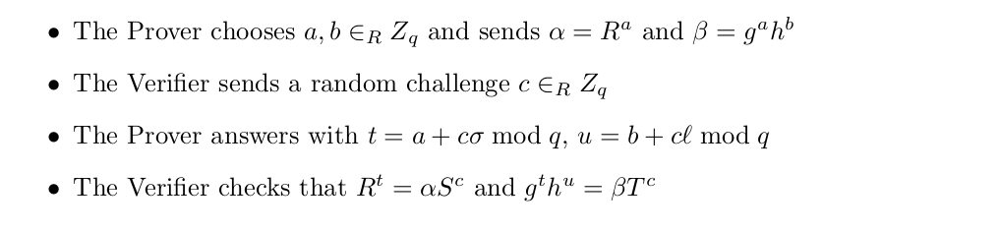
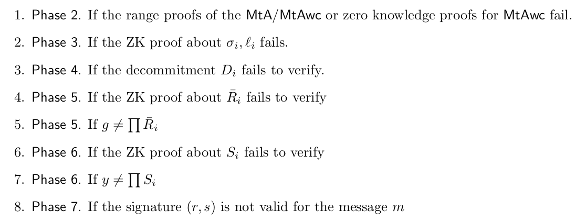
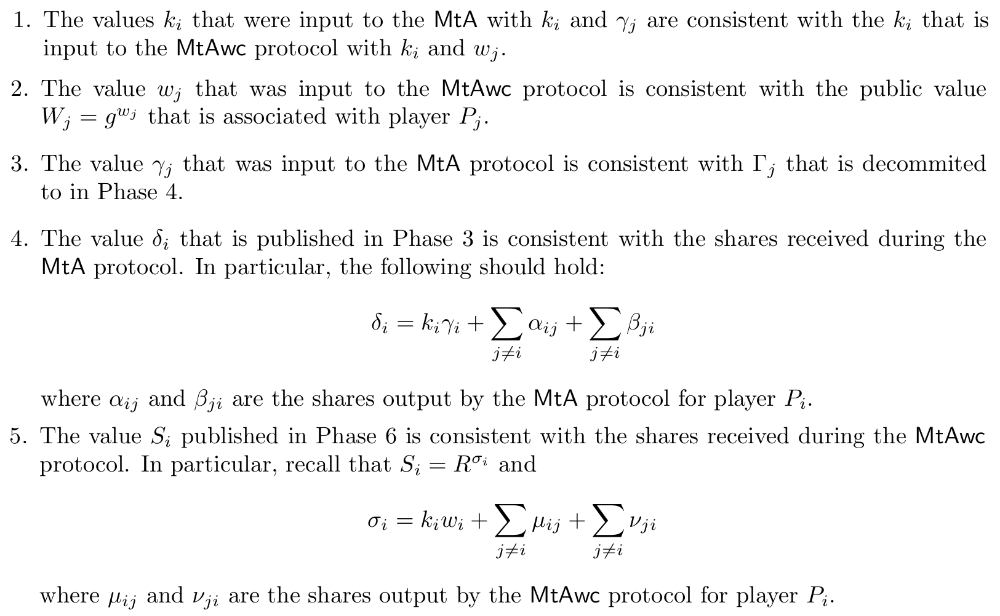
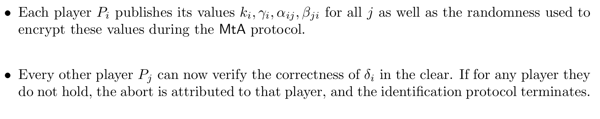
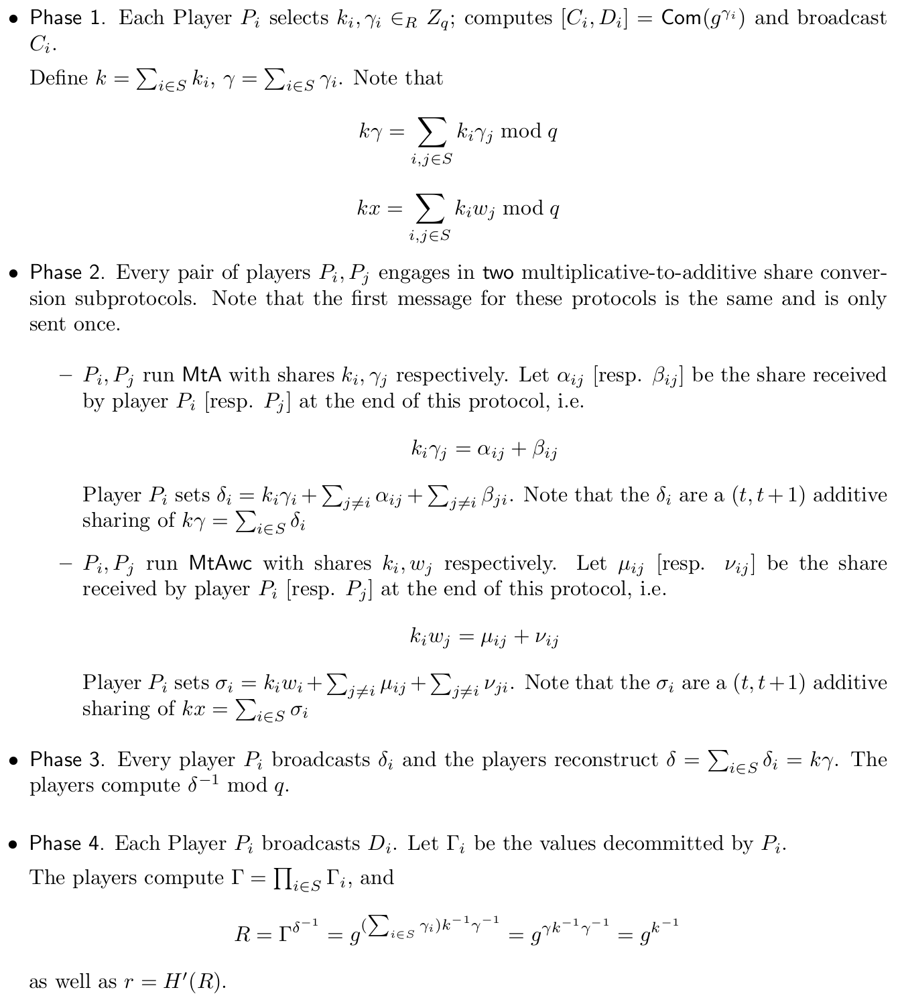

# $(t, n)$ case from Gennaro & Goldfeder (2020)

This work is an improvement on the work of Genaro & Goldfeder (2019). Here, Genaro and Goldfeder present a $(t, n)$ threshold DSA/ECDSA signature protocol in the dishonest majority security model. The main contribution with respect to the work of Genaro & Goldfeder (2019) is that this work provides mechanisms to identify which player is misbehaving in case of an abort. Also, they design a protocol where all the heavy computation can be performed in an offline phase, that is, before the message to be signed is known. Once the preprocessing is finished, the parties engage in an online phase that requires only one round.

For the key generation protocol and the signing protocol, we will present their specifications and then we will show the mechanism used to identify the corrupt parties.

Similar to the previous version of the protocol, we will use multipicative notation for the group $\mathcal{G}$ described by a generator $g$.

## Preliminaries

As in the work of Gennaro & Goldfeder (2019), this work relies on the following preliminaries:
- Additive homomorphic encryption.
- Non-malleable equivocable commitments.
- Verifiable secret-sharing schemes.
- The multiplicative to additive share conversion protocols $\textsf{MtA}$ and $\textsf{MtAwc}$.

We will not cover the above elements because they were covered in the previous section of this document. Also, this work focus on proposing a threshold signature protocol for DSA. Given that this signature algorithm was specified with details in the previous section, we refrain from show the details here again.

### Identifiable abort

It is well known that in an active security model, it is not possible to guarantee the output delivery of the execution of a MPC protocol. If the adversary is active, a corrupt party may refrain from sending the message supposed to be sent which causes that honest parties will not learn the output of the computation. In this situation, the protocol proposed by Gennaro & Goldfeder reaches *security with abort* which means that the adversary can cause the protocol to abort, but in doing so can not learn anything else other than its outputs.

When an abort is produced by the adversary, the protocol proposed in this work guarantees that the honest parties agree on the identity of a party $P_i$ which is a corrupted party. More technically, if F is a functionality computed by the original protocol, then a protocol for F with identifiable abort either computes F or the identity of a corrupted party $P_i$ in case of an abort.

## Key generation protocol

The key generation protocol for this work is very similar to the one presented in Gennaro & Goldfeder (2019). We present it here for completeness. At the end of the protocol, each party $P_i$ will obtain $(t, n)$-shares $x_i$ of a secret key $x$ along with a public key $y = g^x$. Also at the end of the protocol the value of $X_i = g^{x_i}$ is made public.

## Signing protocol

Once the key generation protocol has been executied, the signing protocol is run on input $m$ with $m = H(M)$. Let $S \subseteq [n]$ the set of players involved in the signing protocol. By using the correct Lagrange cohefficients, which can be computed locally by each party, each player $P_i$ can compute an additive share of $x$ by letting $w_i = \lambda_{i,S} \cdot x_i$, where $\lambda_{i,S}$ is the Lagrange coefficient. Notice that $x = \sum_{i \in C} w_i$. Also, given that $X_i = g^{x_i}$ is public (which was computed in the key generation protocol), each party can compute $W_i = X_i^{\lambda_{i, S}} = g^{w_i}$. Below, we present the protocol:

## Zero-knowledge proofs

In the middle of the signing protocol, there are two ZK-proofs that need to be done to guarantee the correctness of the computation.

For the first proof required in Phase 3, the party $P$ outputs $T = g^\sigma h^l$ and must provide a proof that he knows $\sigma$ and $l$ satisfying that equalities. A solution for an honest verifier is as follows:

Another proof that is required in Phase 5, requires that player $P$ who outputs $\bar{R} = R^k$, has to prove that he knows an exponent $k$ consistent with a Paillier ciphertext previously posted $C = E(k)$. A ZK-proof for this statement can be realized using works like [MacKenzie & Reiter (2004)](https://link.springer.com/article/10.1007/s10207-004-0041-0) and [Gennaro et al. (2016)](https://eprint.iacr.org/2016/013.pdf).

Finally, in Step 6, a player $P$ outputs $S = R^{\sigma}$, and must prove that he knows $\sigma, l$, such that fulfills the previous equality and that $T = g^\sigma h^l$. A ZK-proof for this argument is:

## Identifying aborts

As we mentioned before, the protocol presented here have the possibility to identify at least one party responsible for causing an abort in case that the later occurs. In this section, we present the strategies that the present reviewed work takes to make identification possible.

### Key generation

In the key generation, there are two points in which the protocol may fail and abort:
- In Phase 2, a player can complain for receiving an inconsistent Feldman's share.
- In Phase 3, each player proves knowledge of $x_i$ and proves the correctness of their Paillier key. If the proofs fail, then the abort occurs.

If the abort occurs in Phase 3, it is easy to return the identity of the corrupt party. In the second section, a party $P_j$ complains about the inconsistency of a share comming from party $P_i$. In that case, there are two posibilities: (1) $P_j$ in fact received a inconsistent share or (2) $P_j$ is the corrupt party trying to frame $P_i$.

To figure out what of the above situations is really happening, the party $P_j$ reveals the share received from $P_i$ to every other party, and every other party can confirm the consistency of the share of $P_i$. If we assume that the shares are signed, $P_i$ cannot be framed by $P_j$. Notice that opening this share does not hurt the security of the overall protocol because the signature has not been established or used.

### Signing protocol

In the signing protocol, an abort may occur in the following points:

For 1, 2, 3, 4, and 6, the identification of the corrupt party is simple. For the case of item 8, when the signature $(r, s)$ does not verify correctly, it means that at that point $g = \prod \bar{R}_i$ (from Phase 5) and also $y = \prod S_i$ (from Phase 6). At the point of abort, the party $p_i$ can broadcast $s_i$ and check if $R^{s_i} = \bar{R}_i^m \cdot S_i^r$, and the corrupt party would be the party for which this equality does not hold.

It remains to show how to deal with items 5 and 7. According with Gennaro & Goldfeder, the parties ran the protocol correctly if and only if we prove the following:

According with the protocol specifications, Properties 1 and 2 are already enforced because of protocols $\textsf{MtA}$ and $\textsf{MtAwc}$. Thus, to make the protocol identifiable, Gennaro & Goldfeder attend the Properties 3, 4 and 5 separately.

The solution to the remaining properties is based on the fact that $k$ and $\gamma$ can be revealed as long as a signature $s$ has not been published. It can be seen that revealing $k$ as long as a signature $s$ using $k$ allows an attacker to compute the private key $x$ efficiently. The same holds for shares $k_i$ and $s_i$: if $s_i$ has not been published, then it is possible to reveal $k_i$ without hurting the security of the signature scheme.

If the protocol aborts in Phase 5 because $g \neq \prod \bar{R}_i$, the identification protocol works as follows:

For the case of aborts of type 7 in Phase 6, the protocol aborts because $y \neq \prod S_i$. In this case, the parties cannot open the $\textsf{MtAwc}$ protocol between $k_i$ and $w_i$ given that $w_i$ is a share for the secret key. However, it is safe to reveal $\mu_{ij}$ in the clear to check the correctness of $\sigma_i$ in the exponent. We can identify the corrupt party as follows - **we corrected some typos in this section of the protocol**:

- Each player $P_i$ publishes $k_i$ and $\mu_{ij}$ as the decryption of the appropriate cyphertext in the $\textsf{MtAwc}$ protocol.
- Every other party $P_l$ can now verify that the value sent by $P_i$ to $P_j$ was $k_i$ and the value sent by $P_j$ to $P_i$ was $\mu_{ij}$. Given that $g^{w_j}$ is a public value, every party can compute $g^{\nu_{ij}}$ using the equation $g^{\mu_{ij}} = g^{w_j k_i} g^{-\nu_{ij}}$. Then, they can compute
    $$
    g^{\sigma_i} = g^{w_i k_i} \prod_{j \neq i}g^{\mu_{ij}} \prod_{j \neq i}g^{\nu_{ij}}
    $$
- Each player $P_i$ proofs in zero-knowledge the consistency between $g^{\sigma_i}$ from the previous step and $S_i = R^{\sigma_i}$. If the test does not hold for some player, then the abort is attributed to that player.

The ZK-proof of the last step can be found in [Chaum & Pedersen (1993)](https://link.springer.com/content/pdf/10.1007/3-540-48071-4_7.pdf).

## Simplified ECDSA with anonymous aborts

In the case that one is not concerned about identifying aborts, the authors of the revisited work proposes a simpler protocol. The key generation is the same as in the previous protocol, but the signing protocol is slightly different than the previous one. As in the previous protocol, by using the correct Lagrange cohefficients, each player $P_i$ can compute an additive share of $x$ by letting $w_i = \lambda_{i,S} \cdot x_i$, where $\lambda_{i,S}$ is the Lagrange coefficient. Again, notice that $x = \sum_{i \in C} w_i$. Also, given that $X_i = g^{x_i}$ is public (which was computed in the key generation protocol), each party can compute $W_i = X_i^{\lambda_{i, S}} = g^{w_i}$. We present the simplified signature generation protocol next:

## Security concerns

- The original paper of this work is obsolete due to some missing details in the protocol. Also the proof of the protocol is not correct. It is imperative to check that the protocol fulfills all the specifications of the new version of the work.
- The security of this protocol relies on a stronger assumption on the unforgeability of ECDSA. It is relevant to check if these assumptions are suitable and enough for the use case.
- In the previous version of the paper, the simulatability for the protocol $\textsf{MtAwc}$ of the protocol does not hold. In particular, in the case of choosing an small Paillier modulus $N$, the adversary can leverage this fact to retrieve the entire share of the secret key of an honest party. Choosing $N > q^7$ makes the protocol to be secure against this attack. However, the previous version is vulnerable agains this attack for implementations that neglected to take into account this advice about the lower bound of $N$. In the specification of the protocol, party $P_2$ makes sure that the correct value of $N$ is being used.
- The protocol assumes the existence of a broadcast channel and point-to-point channel connectivity between each pair of players. If any party notices an inconsistency in the information sent using the broadcast channel, the protocol must abort and notify every other party.
- The protocol has security guarantees against static corruptions. We need to check that this fact is fulfilled in the use case.
- The authors suggest that the protocol requires non-malleable commitment schemes that are "concurrently" secure. In the paper, there are presented some alternatives to implement this type of commitments.
- In the verifiable secret-sharing schemes (VSS), if the check does not hold for any plaeyer, the party raises a complaint and the protocol must abort.
- In the previous version, the protocol chose $\beta'$ at random and did not perform any range check on it as in the most recent version. This fact also induces an attack similar to the one used on $N$ mentioned in a previous concern. Also, the previous version of the paper uses ZK-proofs that need to be adapted to the bounds presented in the most recent version.
- This paper does not specify what is $h$ in Phase 3. According to one of the authors, this $h$ is a second generator of the curve for which the parties do not know the exponent.
- In Phase 5, parties need to check whether $g = \prod_{i \in S} \bar{R}_i$. If not, the protocol should abort.
- In Phase 6, each party $P_i$ broadcast $S_i = R^{\sigma_i}$, with a ZK-proof to show the consistency between $S_i$ and $T_i$. Also, the parties need to check whether $y = \prod_{i \in S} S_i$.
- In Phase 7, if the resulting signature is not a valid signature for $m$, the protocol must abort.
- To identify aborts, the parties assume that all messages transferred between parties are signed to establish their origin.
- The protocol assumes that there is a broadcast channel to identify the corrupt party that caused an abort. Moreover, this means that every message in the protocol has to be reliably broadcast.
- If the message of some party does not arrive, a local timer is set to some timeout bound before marking that party as corrupt.
- When a corrupt party is identified after an abort, the key generation need to be re-run with fresh randomness to establish a new secure key.
- To detect the corrupt party, the protocol must check the aborts produced in the items presented in Section 4.2. It is needed an special attention in Items 5, 7 and 8:
    - For item 8, the parties can check if $R^{s_i} = \bar{R}^m_i \cdot S_i^r$. If the equation does not hold for some party $P_i$, then it will be the corrupt party.
    - For items 5 and 7, the instructions can be found in Section 4.3.
- There is a possible typo in Section 4.3 in the specification of how to identify the corrupt party for Items of type 7. The correct version of the ecuation in numeral 2 should be: $g^{\mu_{ij}} = g^{w_j k_i} g^{-\nu_{ij}}$, and the next equation should be:
    $$
    g^{\sigma_i} = g^{w_j k_i} \prod_{i \neq j} g^{\mu_{ij}} \prod_{i \neq j} g^{\nu_{ij}}
    $$
- In the simplified version of the protocol for anonymous aborts, the parties should check in Step 7 that $\Lambda = g^\delta$. If the condition holds, the players $P_i$ broadcasts $s_i$, otherwise, the protocol aborts.
- **[List all the zero knowledge proofs]**

# References

- Rosario Gennaro, & Steven Goldfeder. (2020). One Round Threshold ECDSA with Identifiable Abort.
- Chaum, D., & Pedersen, T. P. (1993). Wallet Databases with Observers. In E. F. Brickell (Ed.), Advances in Cryptology — CRYPTO’ 92 (pp. 89–105). Springer Berlin Heidelberg.
- MacKenzie, P., & Reiter, M. K. (2004). Two-party generation of DSA signatures. International Journal of Information Security, 2(3), 218–239. https://doi.org/10.1007/s10207-004-0041-0.
- Gennaro, R., Goldfeder, S., & Narayanan, A. (2016). Threshold-Optimal DSA/ECDSA Signatures and an Application to Bitcoin Wallet Security. In M. Manulis, A.-R. Sadeghi, & S. Schneider (Eds.), Applied Cryptography and Network Security (pp. 156–174). Springer International Publishing.