# (t, n) case from Lindell et al. (2018)

This paper presents a full-threshold ECDSA signing protocol which is the first to have a practical distributed key generation and fast signing. The protocol can be divided into two phases: in the first phase, they propose a protocol based on [Pedersen commitments](https://link.springer.com/chapter/10.1007/3-540-46766-1_9); in the second phase, they replace the Pedersen commitments for ElGamal-in-the-exponent encryption to improve the performance of the protocol.

The strategy of this work is to first propose a protocol for a non-threshold case (i.e. $n$-out-of-$n$, you need all the parties to generate a key and compute a signature). Then they work towards the required solution: first, they propose a solution for an adversary controlling an arbitrary number of parties, and then they propose a solution for the threshold case $t$-out-of-$n$. In intermediate steps, they also propose more efficient alternatives aiming to reduce the number of rounds.

## Preliminaries

Here we denote by $G$ to the generator of an elliptic curve group $\mathbb{G}$ of prime order $q$ using additive notation. Therefore, each element can be described as $a \cdot G$ for $a \in \mathbb{Z}_q$. Also, we denote $\widetilde{\mathbb{G}} = \mathbb{G} \times \mathbb{G}$ as the product group which inherits the natural group operation from $\mathbb{G}$. The elements of $\widetilde{\mathbb{G}}$ will be denoted as $\widetilde{A}$. Also, we fix a security parameter $\kappa \in \mathbb{N}$ for the rest of the section. When describing the protocols, let $\textsf{Store}_k(v)$ be the functionality that stores the value $v$ under the key $k$. Also, let $\textsf{Retrieve}(k)$ be the functionality that returns the value stored under key $k$ or aborts if such key does not exist.

A Pedersen commitmet of a value $m \in \mathbb{Z}_q$ using a public key parameter $D$ and randomness $r$ is defined by 

$$
\textsf{PedCom}_D(m; r) = r \cdot D + m \cdot G
$$

When it is clear from the context, the authors omit the random parameter $r$ in the notation. The authors denote a Pedersen commitment by $\widehat{A} = \textsf{PedCom}_D(a; r)$, for some $a \in \mathbb{Z}_q$. An important feature of Pedersen commitments is that they are homomorphic with respect to the addition in $\mathbb{G}$. Therefore, if $\widehat{A}_0 = \textsf{PedCom}_D(m_1; \cdot)$ and $\widehat{A}_2 = \textsf{PedCom}_D(m_2; \cdot)$, then $\widehat{A}_1 + \widehat{A}_2$ is a commitment for $m_1 + m_2$.

An ElGamal commitment of a message $m \in \mathbb{Z}_q$ with public key $E \in \mathbb{G}$ and randomness $r$ is defined to be

$$
\textsf{EgCom}_E(m; r) = ( r \cdot G, r \cdot E + m \cdot E ),
$$

which turns out to be an element of $\widetilde{\mathbb{G}}$. Therefore, we denote the ElGamal commitments as $\widetilde{A} = \textsf{EgCom}_E(a; r)$, for $a \in \mathbb{Z}_q$. Similarly to Pedersen commitments, ElGamal commitments are also homomorphic concerning the group operation in $\widetilde{\mathbb{G}}$.

The protocols presented in the work covered here depend on ZK-PoK functionalities denoted as $\mathcal{F}_\textsf{zk}^\mathcal{R}$ for a relation $\mathcal{R}$. The paper also lists the relations that will be presented next, but we also include the relations to present a self-contained material and also correct some typos present in the paper. The relations covered in this work will be the following:

- Knowledge of discrete log: 

    $$
    \mathcal{R}_\textsf{DL} = \left\\\{(A, B, w ) \\;\vert\\; B = w \cdot A \right\\\}.
    $$

- $\textsf{DH}$ tuple: 

    $$
    \mathcal{R}_\textsf{DH} = \left\\\{ \left(\widetilde{A} = (A_1, A_2), \widetilde{B} = (B_1, B_2), w \right) \\;\vert\\; \widetilde{B} = w \cdot \widetilde{A} \right\\\}.
    $$ 

    We write $\left(A, \widetilde{B}, w\right) \in \mathcal{R}\_\textsf{DH}$ as a shorthand for $\left((G, A), \widetilde{B}, w \right) \in \mathcal{R}_\textsf{DH}$.

- Knowledge of Pedersen commitment:

    $$
    \mathcal{R}_\textsf{PedKlwg} = \left\\\{ \left((D, \widehat{A}), (a, r) \right) \\;\vert\\; \widehat{A} = \textsf{PedCom}_D(a; r) \right\\\}.
    $$

- Pedersen commitment of a value:

    $$
    \mathcal{R}_\textsf{PedEqVal} = \left\\\{ \left( (D, \widehat{A}, A), r \right) \\;\vert\\; \widehat{A} = \textsf{PedCom}_D(a; r) \right\\\}.
    $$
    
- Pedersen commitment of a value in the exponent: 

    $$
    \mathcal{R}_\textsf{PedEqVal} = \left\\\{ \left( (D, \widehat{A}, A), (a, r) \right) \\; \vert \\; \widehat{A} = \textsf{PedCom}_D(a;r), \\; A = a \cdot G \right\\\}
    $$
    
- Knowledge of ElGamal commitment:
    $$
    \mathcal{R}_\textsf{EGKlwg} = \left\\\{ \left( (E, \widetilde{A}), (a, r) \right) \\; \vert \\; \widetilde{A} = \textsf{EgCom}_E (a; r) \right\\\}
    $$
    
- ElGamal equals Pedersen:  **here, we correct a typo present in the paper**.

    $$
    \mathcal{R}_\textsf{EgEqPed} = \left \\\{ \left ( (E, \widetilde{A}, D, \widehat{A}), (a, \tilde{r}, \hat{r}) \right ) \\; \vert \\; \widetilde{A} = \textsf{EgCom}_E(a; \tilde{r}) \\; \wedge \\; \widehat{A} = \textsf{PedCom}_D(a; \hat{r}) \right \\\}
    $$
    
- Knowledge of ElGamal scalar product:

    $$
    \mathcal{R}_\textsf{EgProdScalar} = \left \\{ \left( (E, \widetilde{A}, \widetilde{B}), (r, c)) \right) \\;\vert\\; \widetilde{B} = c \cdot \widetilde{A} + \textsf{EgCom}_E(0; r) \right \\}
    $$

- Product of ElGamal commitments:
 
    $$
    \mathcal{R}_\textsf{EgProdEg} = \left\\{ \left( (E, \widetilde{A}, \widetilde{B}, \widetilde{C}), (r^b, r^0, b) \right) \\; \vert \\; \widetilde{B} = \textsf{EgCom}_E(b; r^b) \\; \wedge \\; \widetilde{C} = b \cdot \widetilde{A} + \textsf{EgCom}_E(0, r^0) \right\\}
    $$
    
- ElGamal commitment of a value:
    
    $$
    \mathcal{R}_\textsf{EgEqVal} = \left\\{\left( (E, \widetilde{A}, a), r \right) \\;\vert\\; \widetilde{A} = \textsf{EgCom}_E(a; r), \\; A = a \cdot G \right\\}
    $$
    
- ElGamal commitment of a value in the exponent:

    $$
    \mathcal{R}_\textsf{EgEqExp} = \left\\{ \left( (E, \widetilde{A}, A), (a, r) \right) \\; \vert \\; \widetilde{A} = \textsf{EgCom}_E(a; r), \\; A = a \cdot G \right\\}
    $$

## ECDSA protocol

Now, we present an ECDSA protocol for the non-threshold case. This specification was taken directly from Lindell et al. (2018). The high-level idea of the protocol is the following. The signing protocol is a traditional coin-tossing protocol that outputs a random element in the group $\mathbb{G}$ but each party has an additive share of the private key, which in this case is the discrete logarithm of the public key. The signing protocol applied to a message $m$ works by generating shares of two values $\rho, k \in \mathbb{Z}_q$ and then computing the exponent $R = k \cdot G = (r, \cdot)$. Therefore, parties compute $\beta = \rho \cdot (H(m) + x \cdot r)$, and output $(r, s = \tau^{-1} \cdot \beta)$ as the signature. Notice that

$$
\tau^{-1} \beta = \rho^{-1} \cdot k^{-1} \cdot \rho \cdot (H(m) + x \cdot r) = k^{-1} \cdot (H(m) + x \cdot r),
$$

which is precisely the signature shown in the standalone version of ECDSA.

### Key generation

On input $(\textsf{sid}, \textsf{KeyGen})$, party $P_i$ acts as follows:

1. Let $\textsf{oid}_x = \textsf{sid} \\;\Vert\\; "x"$.
2. The parties engage in $\textsf{CreateSharedVal} \left( \textsf{sid}, D, \textsf{oid}_x \right)$.
3. The parties engage in $\textsf{OutExpOfSharedVal} \left( \textsf{sid}, D, \textsf{oid}_x \right)$
4. Output $X$.

### Signing

On input $(\textsf{sid}, \textsf{Sign}, \textsf{oid}_x, m)$, party $P_i$ acts as follows:

1. Abort if $\textsf{oid}_x$ was not stored.
2. Let $\textsf{oid}\_k = \textsf{sid} \Vert 1$, $\textsf{oid}\_\rho = \textsf{sid} \Vert 2$, $\textsf{oid}\_{\rho \cdot k} = \textsf{sid} \Vert 3$, $\textsf{oid}\_{\rho \cdot x} = \textsf{sid} \Vert 4$, $\textsf{oid}\_{r \cdot \rho \cdot x} = \textsf{sid} \Vert 5$, $\textsf{oid}\_{\rho \cdot m} = \textsf{sid} \Vert 6$, $\textsf{oid}\_\beta = \textsf{sid} \Vert 7$.
3. In parallel, the parties engage in: $\textsf{CreateSharedVal} \left( \textsf{sid}, D, \textsf{oid}_\rho \right)$ and $\textsf{CreateSharedVal} \left( \textsf{sid}, D, \textsf{oid}_k \right)$. Here $\rho$ and $k$ denote the generated values.
4. In parallel, the parties engage in:
    1. $\textsf{MultSharedVals}(\textsf{sid}, D, \textsf{oid}\_\rho, \textsf{oid}_k, \textsf{oid}\_{\rho \cdot k})$.
    2. $\textsf{MultSharedVals}(\textsf{sid}, D, \textsf{oid}\_\rho, \textsf{oid}_x, \textsf{oid}\_{\rho \cdot x})$.
5. The parties engage in $\textsf{OutExpOfSharedVal}(\textsf{sid}, D, \textsf{oid}_k)$. Let $(r', \cdot)$ be the common output and let $r = r' \mod q$.
6. Each party invokes:
    1. $\textsf{ScalarMultOfSharedVal}(D, \textsf{oid}\_{\rho \cdot x}, \textsf{oid}_{r \cdot \rho \cdot x}, r)$.
    2. $\textsf{ScalarMultOfSharedVal}(D, \textsf{oid}\_{\rho}, \textsf{oid}_{r \cdot m}, H(m))$.
    3. $\textsf{AdditionOfSharedVals}(D, \textsf{oid}\_{r \cdot \rho \cdot x}, \textsf{oid}\_{r \cdot m}, \textsf{oid}\_{\beta})$.
7. In parallel, parties engage in:
    1. $\textsf{OutSharedVal}(D, \textsf{sid}, \textsf{oid}\_{\rho \cdot k})$; let $\tau$ be the common output.
    2. $\textsf{OutSharedVal}(D, \textsf{sid}, \textsf{oid}\_{\beta})$; let $\beta$ be the common output.
8. Output $\left( r, s = \tau^{-1} \cdot \beta \right)$.

Next, we describe the protocols $\textsf{CreateSharedVal}$, $\textsf{AdditionOfSharedVals}$, $\textsf{ScalarMultOfSharedVal}$, $\textsf{OutSharedVal}$, $\textsf{OutExpOfSharedVal}$, and $\textsf{MultSharedVals}$

### Protocol $\textsf{CreateSharedVal}$:

This protocol creates a Pedersen commitment to a uniformly chosen value. Each party will hold a share of this value which will remain private.

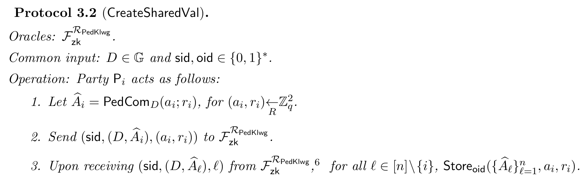

### Protocol $\textsf{AdditionOfSharedVals}$

This protocol adds two committed values under Pedersen commitment. Remember that Pedersen commitments are additively homomorphic, therefore, this operation can be computed locally by each party.

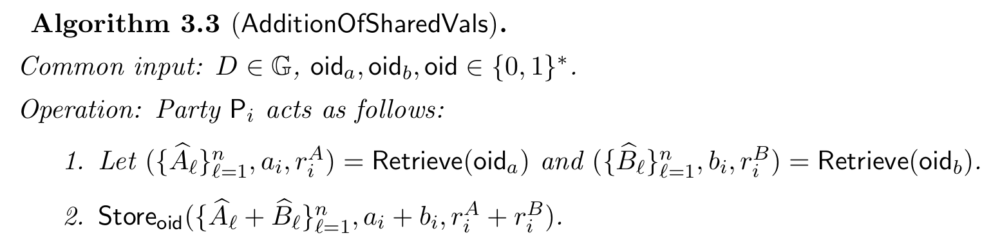

### Protocol $\textsf{ScalarMultOfShareVals}$

This protocol multiplies a publicly known scalar with a previously stored value that is committed under a Pedersen commitment. Knowing that such commitment is additively homomorphic, this operation can be computed locally by each party.

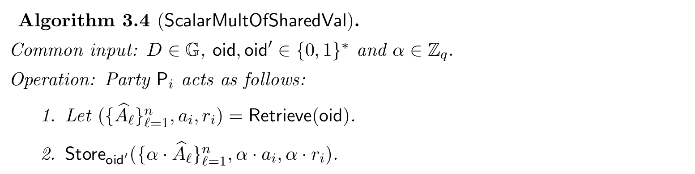

### Protocol $\textsf{OutSharedVal}$

This protocol reconstructs an additively shared value whose shares have been committed using a Pedersen commitment.

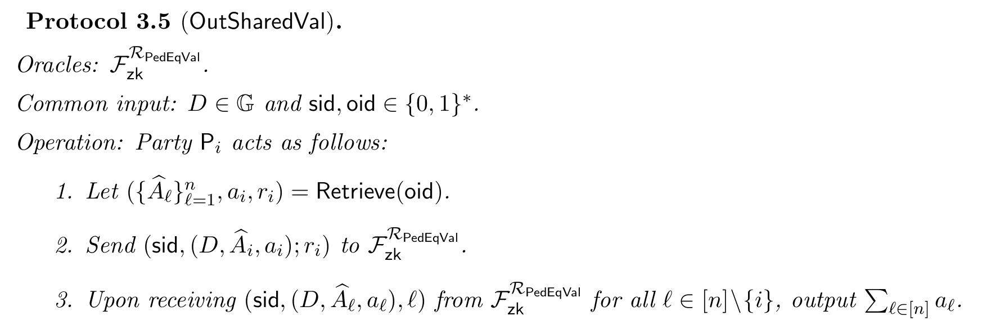

### Protocol $\textsf{OutExpSharedVal}$

This protocol outputs the value $A = a \cdot G$ for a previously stored value $a$. **Here, the functionality is omitting that the party should compute $A_i = a_i \cdot G$ at some point before Step 2.**

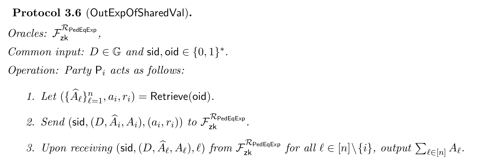

### Protocol $\textsf{MultSharedVals}$

This protocol multiplies a pair of previously generated and stored values and stores an additive share of the multiplication. 

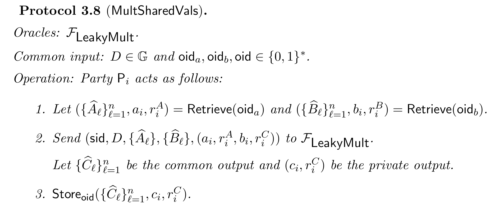

The functionality $\mathcal{F}_\textsf{LeakyMult}$ is a many-party leaky multiplication ideal functionality that multiplies two private values and returns the additive share of the multiplication to each party. Here, they say that it is leaky because the functionality allows to the adversary to know whether a linear relationship of the private shares of each value is equal to some value. Also, the functionality allows the adversary to modify their commitments restricted to the condition of preserving the overall sum. The purpose of giving the adversary this freedom is to obtain more efficient implementations of the protocol. Next, we will show the specification of this functionality. **Here we correct some typos present in the paper**:

**Functionality $\mathcal{F}_\textsf{LeakyMult}$**:

Parties: $P_1, \dots, P_n$.
Common input: $\textsf{sid} \in \\{0, 1\\}^*$, $D \in \mathbb{G}$, $\left\\{ \widehat{A}\_\mathcal{l}, \widehat{B}\_\mathcal{l} \right\\}_{l=1}^n$.
$P_i$'s input: $\left(a_i, r_i^A \right), \left(b_i, r_i^B \right) \in \mathbb{Z}_q^2$.

1. Abort if for some $\mathcal{l}$ it holds that $\widehat{A}\_\mathcal{l} \neq \textsf{PedCom}\_D(a_\mathcal{l}, r_\mathcal{l}^A)$ or $\widehat{B}\_\mathcal{l} \neq \textsf{PedCom}\_D(b_\mathcal{l}, r\_\mathcal{l}^B)$
2. Sample $r_1, \dots, r_n$ uniformly at random from $\mathbb{Z}\_q$. Sample $c_1, \dots, c_n$ uniformly at random from $\mathbb{Z}\_q$ conditioned on
    $$
    \sum_{l=1}^n c_l = \left(\sum_{l=1}^n a_l \right) \cdot \left(\sum_{l=1}^n b_l \right).
    $$
3. Output $\left\\{C_l = \textsf{PedCom}\_D(c_l; r_l)\right\\}_{l=1}^n$ as the common output.
4. Send $\left( r_l, c_l \right)$ to $P_l$ for each $l = 1, \dots, n$.

After getting the outputs, the corrupted parties $\mathcal{C}$ can make the following calls (at most one of each type):

- **Linear test:** send $\delta \in \mathbb{Z}\_q$ and $\left\\{(o_l^A, o_l^B) \in \mathbb{Z}\_q^2\right\\}\_{l \in [n] \setminus \mathcal{C}}$ to the functionality. The functionality aborts if $\sum_{l \in [n] \setminus \mathcal{C}} (o_l^A \cdot a_l + o_l^B \cdot b_l) \neq \delta$.
- **Commitment replacement:** Send $\\{(r'\_l, c'\_l )\\}\_{l \in \mathcal{C}}$. The functionality aborts if $\sum_{l \in \mathcal{C}} c_l \neq \sum_{l \in \mathcal{C}} c'_l$. Otherwise the value of $\widehat{C}_l$, for each $l \in \mathcal{C}$, in the common output is updated to $\textsf{PedCom}_D(c'_l; r'_l)$.

## Threshold case

To this moment, the protocol allows an adversary to corrupt at least $n - 1$ parties. Now, we present an adjustment from Lindell et al. (2018) for adversaries corrupting less than $n - 1$ parties. For this modification, we define the *public view of a party* to the public information it sends and receives: inputs received from the environment, messages it sends and receives, and outputs of the common output ideal functionalities. Also, we call an *outputting round* a round in which the honest parties output a value. The adjustment is as follows: 

1. In each round that proceeds an outputting round, each hones party sends a hash of its public view to all parties. That is, $H'(v)$ where $H'$ is an arbitrary collision-resistant hash function, and v is its current public view.
2. In each outputting round, an honest party first verifies that the hash of all other parties' public view is consistent with its own.

To achieve threshold signatures (i.e. signatures $t$-out-of-$n$), the approach is as follows. In the key generation, the parties generate additive shares as in the $n$-out-of-$n$ case and transform such shares into $t$-out-of-$n$ shares using Shamir secret-sharing. For the signing phase, the parties take the Shamir $t$-out-of-$n$ shares transform them into $t$-out-of-$t$ shares, and proceed as in the non-threshold case.

The protocol for key generation is presented next. **One thing that is missing in the protocol specification is that in Step 2(e)(ii), the parties should execute $\mathcal{F}\_{\textsf{zk}}^{\mathcal{R}\_\textsf{DL}}$ with respect to $D$ given that, under correct circumstances, this should be a Pedersen commitment of 0. Also, here $p_{i, l}$ is a notation for $p_i(l)$.**

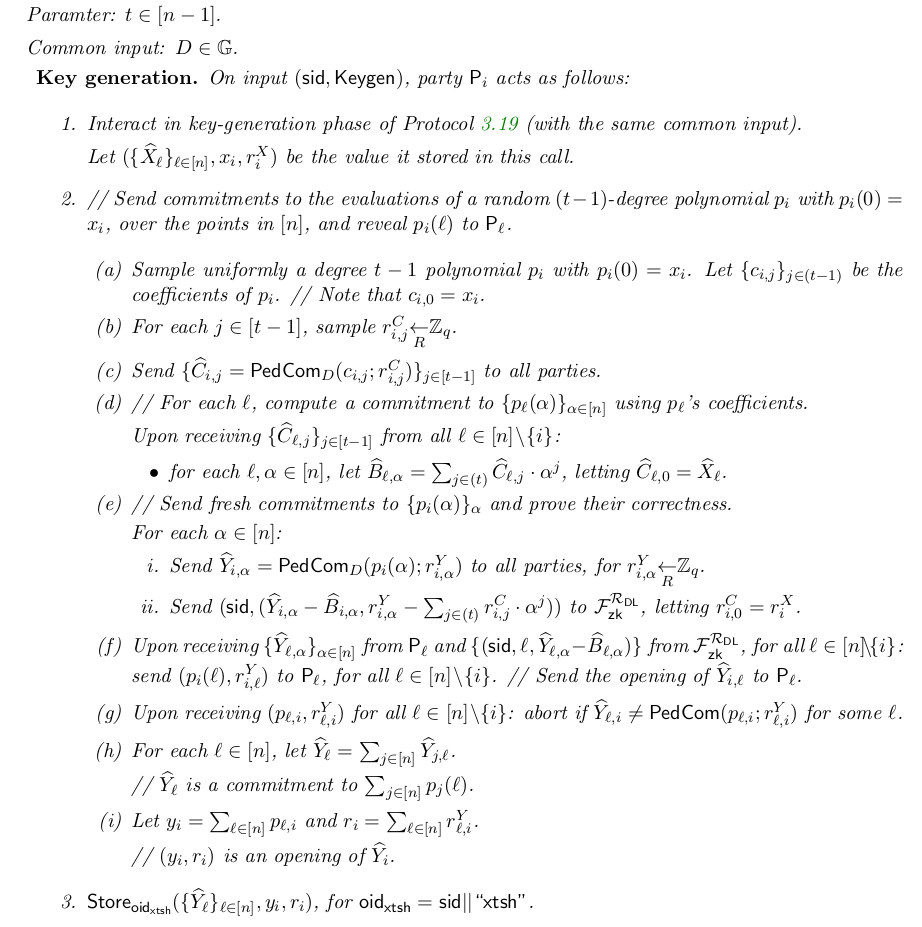

The protocol for signing is presented next. **Here we present a relevant correction to the protocol presented in the original paper.**

1. Let $\mathcal{S} \subseteq [n]$ be the set of active parties (i.e. parties involved in the signing protocol). Abort if $\vert \mathcal{S} \vert \neq t$.
2. (Locally) Generate additive shares of $x$.
    1. For $l \in \mathcal{S}$, let 
        $$
        o_l = \frac{\prod_{j \in \mathcal{S}\setminus\\{l\\}} j}{\prod_{j \in \mathcal{S}\setminus\\{l\\}} (j - l)}.
        $$
    2. Let $\left( \\{ \widehat{A}\_l \\}\_{l=1}^n, a_i, r_i \right) = \textsf{Retrieve}(\textsf{oid}\_\textsf{xtsh})$.
    3. Let $(a'_i, r'_i) = o_i \cdot (a_i, r_i)$, and for each $l \in \mathcal{S}$, let $\widehat{A}'\_l = o_l \cdot \widehat{A}\_l$.
3. Sign using additive shares:
    1. $\textsf{Store}\_{\textsf{oid}' = \textsf{sid} \Vert "y"} \left( \\{ \widehat{A}'\_l \\}_{l=1}^n, a'_i, r'_i \right)$.
    2. Interact as in the signing phase of the signing protocol for the non-threshold case, while in the call of $\textsf{MultSharedVals}$ done in Round 4(2), use the object-id $\textsf{oid}'$ instead of $\textsf{oid}$.

We remain to present a UC-realization of $\mathcal{F}\_\textsf{LeakyMult}$ which is the protocol $\textsf{ManyPartyLeakyMult}$. Such protocol has access to other two ideal functionalities: a two-party multiplication functionality $\mathcal{F}_\textsf{2PC-Mult}$ and a multiplication equality test functionality $\mathcal{F}\_\textsf{PedMultEqTest}$. For this text to be self-contained, we present the functionalities next taken from the original paper:



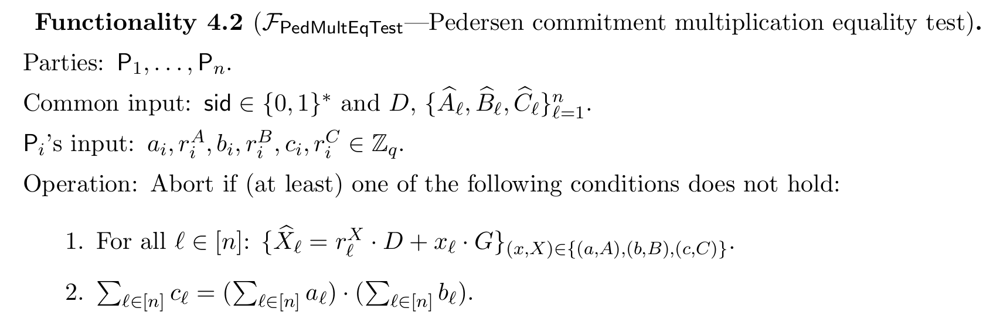

We stress that performing the check using $\mathcal{F}\_\textsf{PedMultEqTest}$ is key because the functionality for multiplications does not force the parties to input the correct and committed values, resulting in a wrong output. Then, the functionality for multiplication check will be in charge of testing and avoiding this behavior. The functionality $\mathcal{F}\_\textsf{2PC-Mult}$ will be then replaced by a more weak functionality $\mathcal{F}\_\textsf{2PC-WeakMult}$. Whose realization can be found in [Haitner et al. (2021)](https://eprint.iacr.org/2021/1373), and such replacement will not affect the security of the overall protocol. For reference, we present next the weak functionality. **It is important to mention that the version of this functionality in the paper of Lindell et al. has a small typo in the number of elements of $v$. The following functionality has the correct specification.**

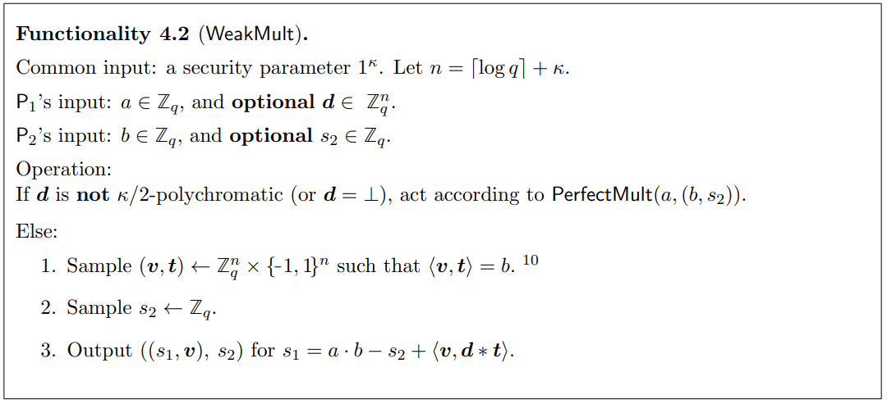

Also, we next present the functionality $\mathcal{F}_\textsf{PedMultEqTest}$:

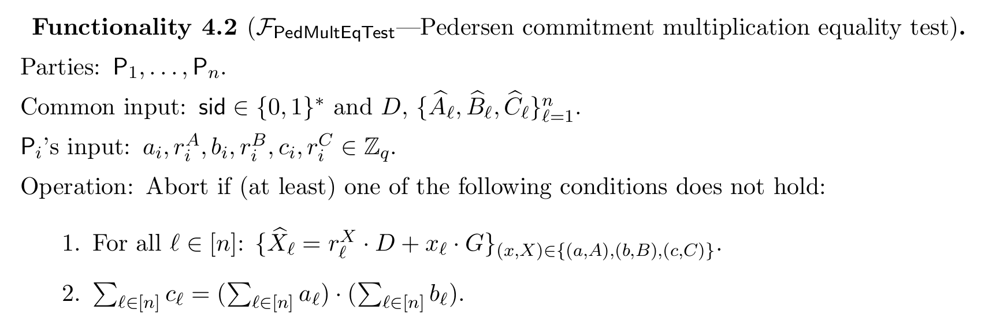

Now, having all the functionalities, we present the protocol $\textsf{ManyPartyLeakyMult}$ that UC-realizes $\mathcal{F}\_\textsf{LeakyMult}$. We are considering the protocol accessing to the functionality $\mathcal{F}\_\textsf{2PC-Mult}$, but replacing it with $\mathcal{F}_\textsf{2PC-WeakMult}$ is done in a natural way.

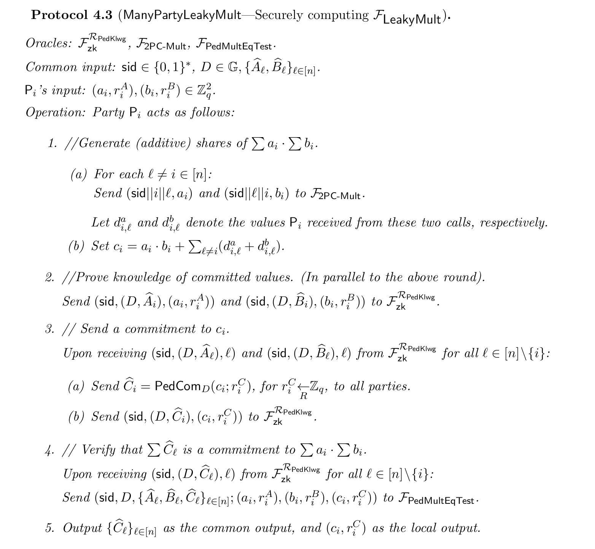

Finally, we present the protocol that realizes the functionality $\mathcal{F}_\textsf{PedMultEqTest}$. As we mentioned earlier, this protocol is key for checking the correctness of multiplications in the overall protocol.

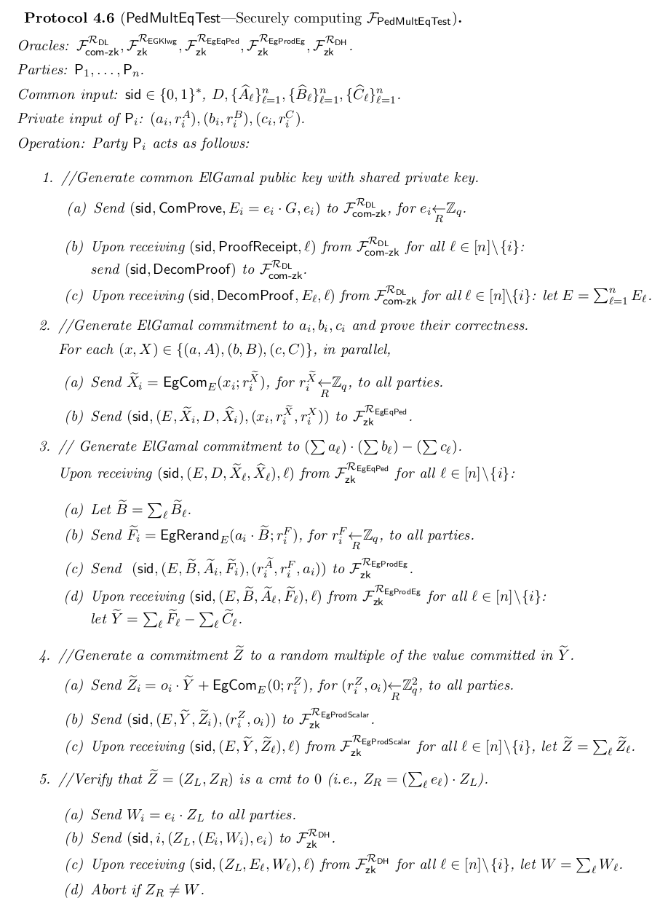

Although the protocol presented here is the main version of the Threshold ECDSA protocol, Lindell et al. present multiple improvements to reduce the number of rounds needed to generate keys and compute signatures. These improvements can be found in Sections 3.5 and 4.5.

## Security concerns

- In general, the protocol specification in this work has some notation issues and typos. Although a careful reading of the paper may reveal this errors, they may cause also implementation errors by software developers that are not experts in cryptography. We corrected those typos in this document and the corrections were marked in red inside the text.
- The protocol assumes an authenticated point-to-point channel between parties. Therefore we must ensure that the channels fulfill this property.
- The protocol assumes that the environment provides fresh session id on each invocation it makes. To do this the parties need to choose fresh session id which can be computed using a single round coin-flipping protocol. Such protocol consists in the parties sending uniform strings to each other and the session id is set to be the hash of their concatenation.
- The protocol assumes that all the honest parties agree on the common input. Such agreement can be done by leting the parties send a hash of their common input in the first round of each protocol and its sub-protocols.
- In both the key generation and the signing protocol, they make calls to the protocol for zero-knowledge functionalities. The parties should verify that the session id and the instance it receives for the zero-knowledge protocol are consistent with the common input of the previous steps of the protocol in which the zero-knowledge is being executed. 
- In the non-threshold protocol, it is important to consider as public view all the elements that the paper lists in each verification step.
- Missing an execution of $\mathcal{F}_\textsf{PedMultEqTest}$ in the protocol $\textsf{ManyPartyLeakyMult}$ could end in a wrong multiplication with catastrophic results due to the high possibility of an adversarial behavior.
- For the key generation and the signing protocol we need to be careful of all the ZK proofs involved in the procedure. **[List all the ZK proofs involved]**.

# References

- Lindell, Y., & Nof, A. (2018). Fast Secure Multiparty ECDSA with Practical Distributed Key Generation and Applications to Cryptocurrency Custody. Proceedings of the 2018 ACM SIGSAC Conference on Computer and Communications Security, 1837–1854. https://doi.org/10.1145/3243734.3243788
- Haitner, I., Makriyannis, N., Ranellucci, S., & Tsfadia, E. (2022). Highly Efficient OT-Based Multiplication Protocols. In O. Dunkelman & S. Dziembowski (Eds.), Advances in Cryptology – EUROCRYPT 2022 (pp. 180–209). Springer International Publishing.
- Pedersen, T. P. (1992). Non-Interactive and Information-Theoretic Secure Verifiable Secret Sharing. In J. Feigenbaum (Ed.), Advances in Cryptology — CRYPTO ’91 (pp. 129–140). Springer Berlin Heidelberg.
