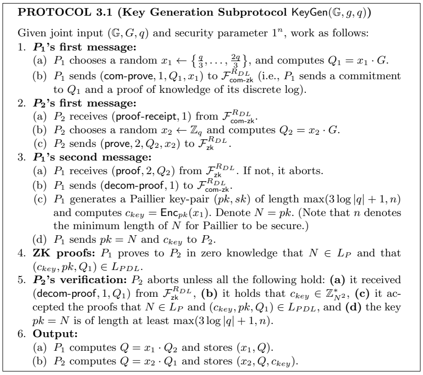
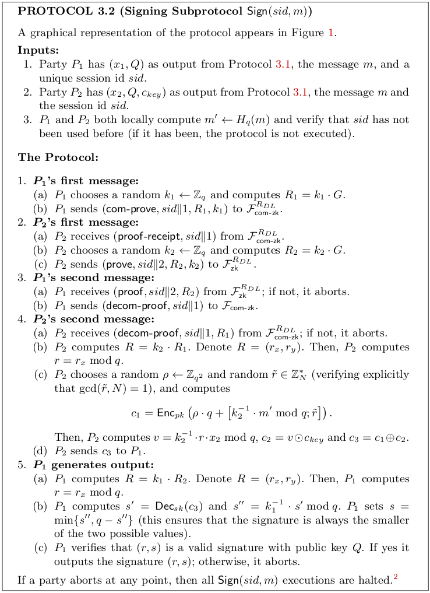

# (2, 2) case from Lindell (2021)

In this case, we will have two parties $P_1$ and $P_2$. Both parties will have a secret key that is secret-shared among them which means that $P_1$ will hold a value $x_1 \in \mathbb{Z}_q$ and $P_2$ will hold a value $x_2 \in \mathbb{Z}_q$. The idea is to use both pieces of data to compute the signature of a jointly known message. The main difficulty that can be found in this scheme is that for the signature we need the inverse of a random value $k \in \mathbb{Z}_q^\*$ that is secret-shared among the parties. Concretely, for the signing phase, we need to compute $k^{-1}$ for a value $k \in \mathbb{Z}_q^*$ that is shared among the parties ($P_1$ will hold a share $k_1$ and $P_2$ will hold a share $k_2$). This process is very hard considering a additive secret-sharing scheme. For that reason, the work of Lindell (2021) considers a multiplicative secret sharing scheme, which will allow to compute this inverse in a more easy way.

To completely specify the key generation and signing protocols, they significantly use the Paillier public-key homomorphic encryption scheme. Such encryption scheme will be specified using the traditional triple of algorithms $(\textsf{Gen}, \textsf{Enc}, \textsf{Dec})$. Here, we denote by $\oplus$ the operation between ciphertexts that produces the encryption of the sum of the underlying clear messages, and similarly, we denote by $\odot$ the multiplication of ciphertext that obtain the encryption of the product of the underlying messages.

Additionally, we first need to describe ideal functionalities for some zero-knowledge proofs used to compute both protocols. Those ideal functionalities are:
- $\mathcal{F}\_{\textsf{com-zk}}^{R_{DL}}$: This ideal functionality will be defined for thesting in the following relation:
    $$
    R\_{DL} = \left\\\{\left(\mathbb{G}, G, q, P, w \right) \\\;\vert\\\; P = w \cdot G\right\\\}.
    $$
    Therefore, this zero-knowledge proof will determine if some witness secret value $w$ is the discrete logarithm of a value $P$ relative to a cyclic group $\mathbb{G}$ with order $q$ described by the generator $G$. Additionally, this functionality will allow to one party to commit to values $P$ and $w$ and then decommit such value for the other party to receive $P$ if the proof confirms that $(P, w)$ fulfill the relation relative to the group $\mathbb{G}$ specified as above. This proof can be instantiated using classic protocols as presented in [Schnorr (1989)](https://link.springer.com/chapter/10.1007/0-387-34805-0_22).
- $\mathcal{F}\_{\textsf{zk}}^{R_{DL}}$: this functionality has the same zero-knowledge properties as the above functionality but without the commitment section. This proof can be instantiated using the implementation of Schnorr (1989) as above.
- Proof for $L_P$: we need a zero-knowledge proof to test that a number $N$ is a valid Paillier public key. This can be done by computing a zero-knowledge proof for the following language:
    $$
    L_P = \left\\\{N \\; \vert \\; \gcd(N, \phi(N)) = 1 \right\\\}
    $$
    This proof can be generated as presented in [Hazay et al. (2011)](https://eprint.iacr.org/2011/494).
- Proof for $L_{PDL}$: we need to prove in zero-knowledge that a ciphertext is the encryption of the discrete logarithm of a specified point under a public key $pk$ using the Paillier homomorphic encryption scheme. Concretely, the language for this zero-knowledge proof can be described as follows:
    $$
    L_{PDL} = \left\\\{ \left(c, pk, Q_1, \mathbb{G}, G, q \right) \\\; \vert \\\; \exists (x_1, r), c = \textsf{Enc}_{pk}(x_1; r) \\\; \text{and} \\\; Q_1 = x_1 \cdot G \\\; \text{and} \\\; x_1 \in \mathbb{Z}_q \right\\\}
    $$
    An instantiation of this functionality can befound in Lindell (2021), Protocol 6.1.

## Key generation

The idea for the key generation protocol is to consider a coin tossing protocol to generate a random element $Q$, which in this case will be the public key for the signature scheme. To do this, the party $P_1$ will generate a random element $x_1$. $P_1$ will commit to de value $Q_1 = x_1 \cdot G$ and will send a zero-knowledge proof of knowledge that $x_1$ is the discrete logarithm of $Q_1$. In a similar way, $P_2$ will generate a random element $x_2 \in \mathbb{Z}_q$ and send $Q_2 = x_2 \cdot G$ along with a zero-knowledge proof of knowledge that $x_2$ is the discrete logarithm of $Q_2$. Then, the goal is to compute $Q = x_1 \cdot Q_2 = x_2 \cdot Q_1$ and output it as the public key. $P_1$ and $P_2$ will keep $x_1$ and $x_2$ as multiplicative shares of the secret key.

A very interesting thing here is that $P_1$ will generate a Paillier key pair $(sk, pk)$, and will compute $c_{key} = \textsf{Enc}_{pk}(x_1)$ and send it to $P_2$ for a further use in the signing protocol.

## Signing

In this phase, $P_1$ and $P_2$ execute a "coin tossing" protocol as in the key generation phase to compute a random point $R$ in the elliptic curve in such a way that $P_1$ and $P_2$ hold $k_1$ and $k_2$ respectively, such that $R = k_1 \cdot k_2 \cdot G$. Notice that keeping $k_1$ and $k_2$ is of high importance for security. Notice that if some party learn $k_1 \cdot k_2$, then it could compute the secret key $x$ given a signature of some arbitrary message.

For the signing phase, notice that $P_2$ has an encryption of $x_1$ under $P_1$'s public key generated by the Paillier encryption scheme. This allows to $P_2$ to compute an encryption of $s' = k_2^{-1} \cdot m' + k_2^{-1}\cdot r \cdot x_1 \cdot x_2$ under Paillier using the public key of $P_1$, Then $P_1$ can decrypt this value and multiply it for $k_1^{-1}$ to obtain $s''$ which is almost the signature. Then, the party computes the signature as $s = \min\\{s'', q - s''\\}$ to ensure that the parties are choosing the smallest value possible for the signature. Something interesting here is that $P_1$ can verify the validity of the signature under public key $Q$ because, as we specified before, the protocol allow to each party to individualy verify signatures using the public key.

Note that in this work, they are mixing the ECDSA signature scheme with the Paillier encryption scheme. This mixture needs additional consideration given the difference in the modulus reduction because ECDSA computes reductions modulo $q$ but Paillier computes reductions modulo $N^2$, which do not necessarilly match, and such reductions affect the security of each method. Therefore, when we use Paillier, we need to mask the underlying plaintext in such a way that the decryption does not reveal any information. That is the role of $\rho \cdot q$ in $P_2$'s second message. The idea is to mask the value of $k_2^{-1} \cdot m' + k_2^{-1} \cdot r \cdot x_2 \cdot x_1$ with a random looking value, namely $\rho \cdot q$, in such a way that when this the masked value is reduced modulo $q$ the mask is removed.

## Security concerns

- The inadequate handling of abort signals as specified by the protocol can allow to an adversary to recover the private signing key. The details of the attack can be found [here](https://nvd.nist.gov/vuln/detail/CVE-2023-33242). Also, [Makriyannis & Yomtov (2023)](https://eprint.iacr.org/2023/1234) show a vulnerability associated with poor abort handling.
- In the key generation:
    - Check the lenght of Paillier keys to be correct (see Protocol 3.1 from Lindel, 2021).
    - $P_2$ should verify and execute all the ZK-proofs **[List all the ZK-proofs in detail]**.
    - In the distributed signing, $P_2$ can compute a value $s' = k_2^{-1} \cdot m' + k_2^{-1} \cdot r \cdot x_2 \cdot x_1$ using Pallier homomophic properties to obtain a ciphertext of it. Then $P_2$ can send this ciphertext to $P_1$ but the decryption of such value can reveal information to $P_1$ because $s'$ does not have a reduction modulo $q$. Remember that the modulus in Paillier may be different to the modulus used in ECDSA. To prevent this, $P_2$ must add $\rho \cdot q$ inside the encryption for a $\rho$ taken at random. In Lindell, 2021, they suggest to choose $\rho \stackrel{R}{\leftarrow} \mathbb{Z}_{q^2}$.
    - $P_2$ may send a incorrect $s'$. Therefore, $P_1$ must check that the signature is correct. However, $P_2$ could adversarially choose $s'$ so that $P_1$ accepts or rejects the signature $s = k_1^{-1} \cdot s'$ given a condition on $x_1$ known to $P_2$. In that case, $P_2$ can extract information about $x_1$.
- In the signing protocol:
    - $P_1$ and $P_2$ check if the session ID $sid$ has not been used before. If it happens, the protocols shouldn't be executed.
    - Execute all the ZK-proofs in the signing protocol **[List all the ZK-proofs in detail]**.
    - In $P_2$'s second message, it should veryfy that $\gcd(\tilde{r}, N) = 1$.
    - Check that the signature $s = \min\\{s'', q - s''\\}$. Remember that for a signature $(r, s)$, $(r, -s)$ is also a valid signature.
    - To compute the signature correctly, the $N$ choosen for Paillier must hold $N > q^3 + q^2$.